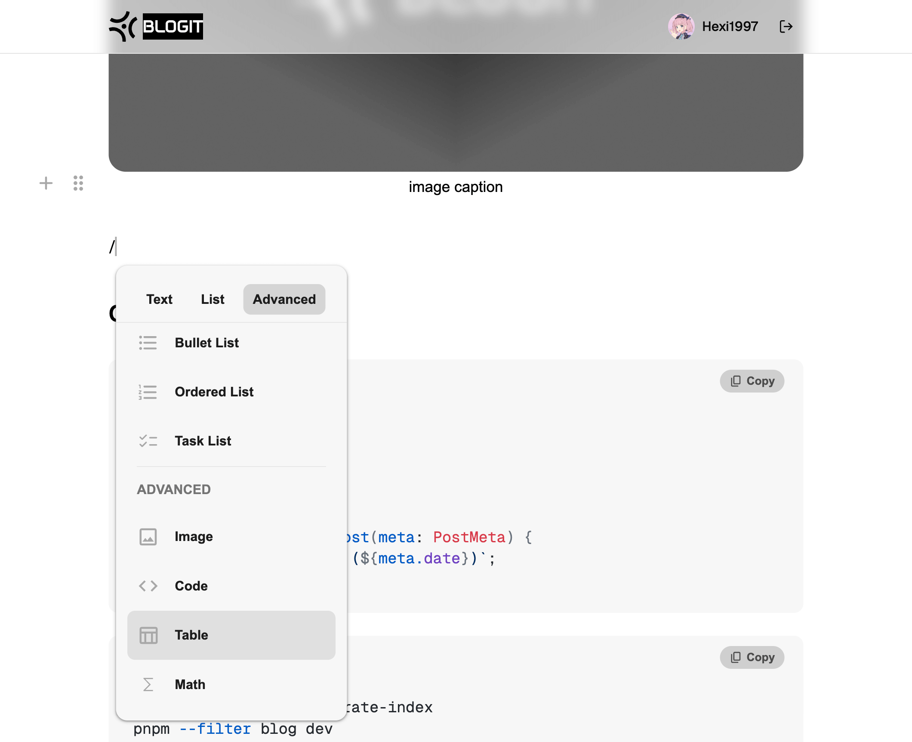

When building **Blogit Admin**, I wasn’t looking for a generic rich text editor. I wanted an editor that felt good for writing while still preserving Markdown.

For Blogit, the source of truth is always the Markdown files in the Git repository.\
So the editor in the admin has to satisfy two things at the same time:

* It needs to be friendly enough for normal users
* It needs to be faithful enough to Markdown

That is why I ultimately chose **[Milkdown](https://github.com/Milkdown/milkdown)**.

## What I care about most is block editing

Writing a blog post is not really about editing one long string. It is about organizing a set of content blocks.

* A heading is a block
* A paragraph is a block
* A quote is a block
* A code block is a block
* An image is also a block

Milkdown fits this writing model very well.\
It makes users feel more like they are manipulating blocks, rather than manually writing Markdown syntax.

That means:

* Inserting a heading without typing `##`
* Switching to a quote block without manually adding `>`
* Creating a code block without remembering triple backticks
* Treating an image as a content unit instead of stitching a file path into text

For Blogit Admin, this block editing experience matters more than a bigger toolbar.

## Why not [Tiptap](https://github.com/ueberdosis/tiptap) ？

Tiptap is a strong editor framework, and it also has solid block editing support. But it is still **RichText-first**.

If your system ultimately outputs HTML, Tiptap is a very reasonable choice.\
But Blogit is different. Blogit stores its source content as Markdown.

That is also why I lean more toward Milkdown:

* Tiptap is stronger as a rich text framework
* Milkdown is closer to a Markdown-first model
* Tiptap is more likely to drift toward editor-internal formats
* Milkdown is better suited to a workflow where editing is visual but the result still goes back to Markdown

It is not that Tiptap is bad.\
It simply solves a slightly different problem from Blogit Admin.

---

在做 **Blogit Admin** 时，我想要的不是一个普通富文本编辑器，而是一个既适合写文章、又不会破坏 Markdown 的编辑器。

对 Blogit 来说，内容的源头始终是 Git 仓库里的 Markdown 文件。\
所以后台编辑器必须同时满足两件事：

* 对普通用户足够友好
* 对 Markdown 足够友好

这也是我最后选择 **[Milkdown](https://github.com/Milkdown/milkdown)** 的原因。

## 我最看重的是 Block 编辑

写博客不是在编辑一长串字符串，而是在组织一组内容块。

* 标题是一个 block
* 正文是一个 block
* 引用是一个 block
* 代码块是一个 block
* 图片也是一个 block

Milkdown 很适合这种写作方式。\
它让用户更像是在操作 Block，而不是手写 Markdown 语法。

这意味着：

* 插入标题不需要手敲 `##`
* 切换引用不需要自己补 `>`
* 写代码块不需要记三反引号
* 插图更像插入一个内容单元，而不是拼接一段路径

对 Blogit Admin 来说，这种 Block 编辑体验比单纯的 toolbar 更重要。

## 为什么不是 [Tiptap](https://github.com/ueberdosis/tiptap) ?

Tiptap 是一个很强的编辑器框架，并且也有完善的 Block 编辑支持。但它是 **RichText-first**。

如果你的系统最终输出的是 HTML，那 Tiptap 很合理。\
但 Blogit 不一样，Blogit 的源文件是 Markdown。

这也是我更偏向 Milkdown 的原因：
