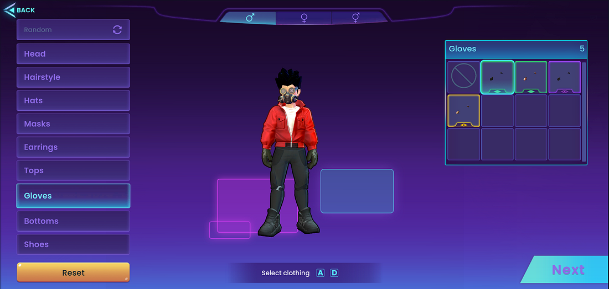
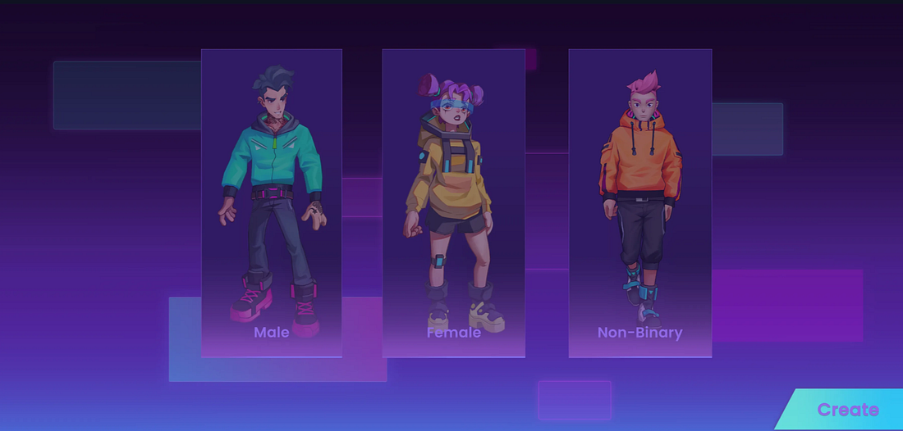

## EXPRESS YOURSELF: Matrix World Presents — Custom Avatars.

How can an online world be immersive, interactive, and collaborative without your customizable avatars?

The team at Matrix Labs know that to be all of those things and more, they need to be personal and empowering.

That’s why we are proud to announce Matrix World’s newest feature: The Avatar Editor. A month ago, we unveiled the Castle Build, an innovative release that prioritizes community engagement and the enrichment of the experience of our users. The Avatar Editor is one of the many features we are excited to roll out for our users, to elevate customization, and offer you all an extensive selection of clothing and accessories to bring your avatars to life.

We continue to deliver on our Roadmap Features that will make the Matrix World MetaVerse a long-term contender for Web 3 social hubs.

So what are you waiting for? [**Log in, customize your avatar, and let your Matrix Universe self reflect who you are or who you might want to be.**](https://matrixworld.org/world)

## What’s in store for you?

_Avatar Editor_

## Good Looking Models

Our team designed these characters to look good by fusing the aesthetics of anime and “Western” art styles to allow you to create avatars that are sophisticated, sleek, and cute, all at the same time. It’s entirely up to you.

## Stylish, In- and Out of This World

The avatars in Matrix World are dressed in gear that is inspired by fashion in both the real world and fantasy, including **Techwear**, **Nufashion**, **Harajuku**, and **Future Punk**. The sky is the limit here at Matrix Labs. Matrix World takes place outside the bounds of Earth, so we have made clothes that match that aesthetic.

And you aren’t limited to a singular aesthetic either! **You can mix and match any way you want.** And, in the future, you can make your own!

Since we are still in beta, **we’re letting you have access to all the styles** so you can try them out without worrying about committing to a particular look yet.

You’ll have a lot of fun picking your wearables — each piece is meticulously designed with love from our 3D artists and animators.

Check out this video for some examples:

## Self Expression

Self-expression is the name of the game. We know it, and **while we’ve already got a bazillion combos for you to try out,** this is only a fraction of what we have in store.

The long-term plan is to allow artists and animators to craft clothing sets in the future. So, if you’re an artist interested in character art and fashion, **watch the Matrix World Blog for updates.**

## “Genderful” Customizations

Matrix Labs operates on decentralized principles, emphasizing open access and participation. We want to involve you in the creation process, and what better way to do that than by allowing our users to create avatars that reflect what they want to represent.

In Matrix World, you can customize your avatar to present as male, female, and non-binary. And from there, our users can select from a diverse range of skin tones, hairstyles, and colours.

We always hope to be a platform that provides our users with the tools they need to engage meaningfully. So please reach out if you have any feedback or comments!

Matrix Labs operates on decentralized principles, emphasizing open access and participation. We have never been a company to gatekeep to creation process for our users, and why would we start now? In Matrix World, you can customize your avatar to present as male, female, and non-binary. And from there, our users can select from a diverse range of skin tones, hairstyles, and colours. We always hope to be a platform that provides our users with the tools they need to engage meaningfully. So please reach out if you have any feedback or comments!

> The goal is for the community _to immerse in their avatar-building experience fully_. _When finished, the player will smile and say, “That’s how I want to participate in Matrix World.”_ — Michael Grills, Matrix, World Product Director*.*

## Tradable Assets

At this stage in our roadmap, we aren’t yet able to trade the outfits, but this is a Web3 project, which means in the future, **these outfits can be bought and traded on multiple blockchains**.

## What’s Next, Tokens, AI, and Emotes?

## Tokens

The virtual sky is the limit! In the near term, you can expect huge updates on the token system. The whitepaper will lay the foundation on which a thriving ecosystem will develop. You will have a direct impact on all things Matrix World, and we are thrilled to watch it unfold!

More info on that soon.

## AI

We already have limited AI inside Matrix World in the form of Tour Guides. But we got some big ideas for **real AI Agents you can interact with.** There’s no reason for you not to be paying attention to what Matrix World will offer.

## Emotes

We’re already working on our Emote system. So, while you are playing with fashion, hairstyles and colouring your Avatar, keep in mind that your chat options will open up big time. **You’ll find Matrix World will let you express yourself in millions of ways.**

## Visit Matrix World

We’re excited to see your avatars chillin’ in Matrix World — make sure to screenshot and share with us in [Discord](http://discord.gg/bMQh4ztyhP) and by tagging @theMatrixWorld on [X](https://twitter.com/theMatrixWorld)!

Also, if you have any feedback, good or bad, please let us know in [Discord](http://discord.gg/bMQh4ztyhP).

**About Matrix World**

Matrix World, inaugurated in 2021 by its parent company Matrix Labs, stands as one of the first multichain metaverses of its kind. Matrix World was conceived to focus on accessibility, therefore not confining developers and end-users to a single blockchain. It offers a multi-chain 3D metaverse that serves as both a social and operational nexus. Matrix World’s commitment to flexibility, inclusivity, and interoperability marks a new era for digital ecosystems, where the barriers between different web dimensions are seamlessly bridged, fostering a thriving and interconnected digital landscape. In February 2022, Matrix World successfully secured $5.5M from 17 investors during angel-round funding at a $50M valuation, thereby strengthening the growth and development of the Matrix World project.

**To learn more about Matrix World or get in contact, please visit the links below:**

[Website](https://matrixworld.org/home)

[Twitter](https://twitter.com/theMatrixWorld)

[Telegram chat](https://t.me/MatrixWorldM)

[Discord](http://discord.gg/bMQh4ztyhP)

[Youtube](https://www.youtube.com/@matrixworldofficial/videos)
