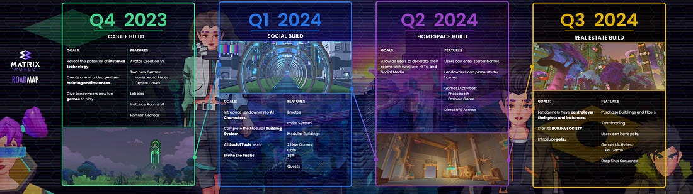
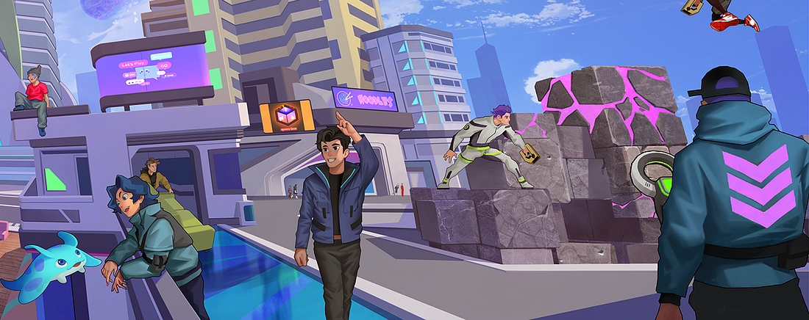
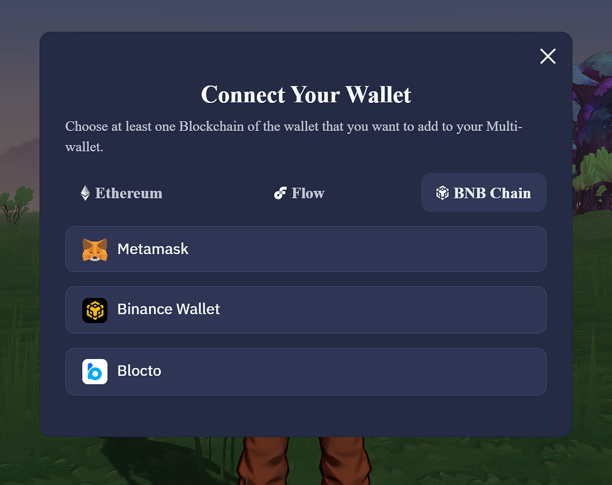
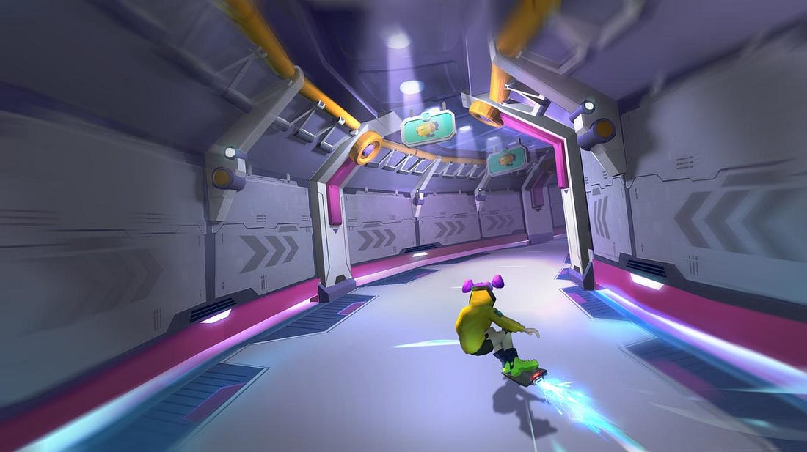
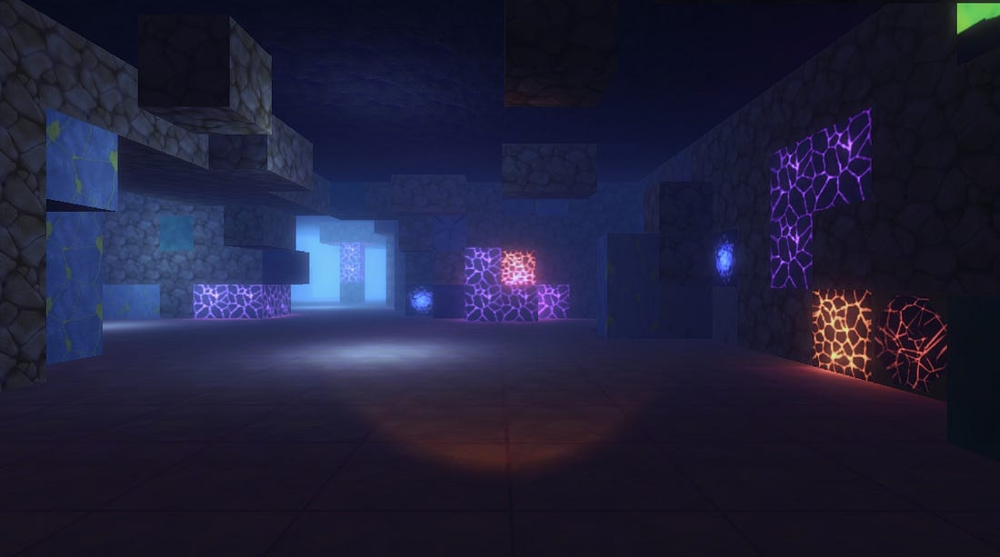

Today, we proudly introduce the second major update to Matrix World, the Castle Build. This release is packed with a range of new features, including minigames, avatar customization, and an inscription service, which we will start rolling out in the coming weeks.

_Matrix World Roadmap_

The Castle Build will be exclusive to Landowners. However, Matrix World is set to open to the public in our forthcoming Social Build, slated for release in Q1 2024.

With the launch of Castle Build, the Matrix World team has opted for a new release strategy. For this release, and possibly future ones depending on the community feedback from the Castle Build launch, we plan to release key features as soon as they are developed and ready. This approach will grant Landowners early access to new features, allowing them to enjoy these updates without waiting for the entire build to be completed; our first two features are targeted for release before the end of this year. Additionally, it gives Landowners the opportunity to help shape Matrix World by providing valuable feedback to our team during the early stages of feature development.

_Matrix World — Concept Art_

Key features set for release with the Castle build include the Avatar Editor, an Avatar PFP Inscription Service, the integration of a new blockchain network, the Instance System, the Hoverboard Race and Crystal Caves Minigames, and Lobbies, as detailed below.

## New Features

**Avatar Editor:** As the world evolves, so do the customization options for our users. With this release, we introduce a wide range of clothes and accessories to bring your avatar to life! These items include hair, tattoos, tops, bottoms, shoes, hats, masks, and more. We’re excited to see the combinations that the community comes up with.

_Avatar Editor_

**Avatar PFP Inscription:** Never before seen in a metaverse, Matrix World will allow users the option of inscribing their avatar as a PFP (Profile Picture) permanently on-chain using inscriptions. Inscriptions have become a popular method for storing immutable, arbitrary data inside a transaction. They are unique in that the ‘image’ is stored directly on-chain and does not rely on an external database like IPFS or Arweave. In our case, this data is a picture of the user’s avatar, stored forever!

**BNB Smart Chain Integration:** It’s with much excitement that we announce the integration of BNB Smart Chain (BSC) into Matrix World. We believe BSC is a great fit for Matrix World with its low transaction costs and high throughput. This addition to our existing chains, Flow and ETH, does not impact land supply and is part of the project’s broader vision to become a leading multichain metaverse. We believe that by adding more chains and providing access to our Matrix SDK, we will welcome a broader range of Web3 communities and builders. For more information, please read our article linked below.

_BNB Smart Chain Integration_

**UI Update:** You’ll notice that the Castle Build also comes with a user interface refresh, featuring a more modern look that complements our Matrix World styling. This update will be reflected in all areas of the world!

**Instance System:** A key feature of the Castle build is the introduction of instances, which provide access to segregated computational resources distinct from those managing the world itself. For example, our minigames operate on their own instances. This means that even under heavy load, these dedicated resources will not impact users in other areas of the world. Instances will be utilized throughout Matrix World for various environments, including minigames (Hoverboard Race & Crystal Caves), rooms in buildings, NFT galleries, and more.

**Minigames:** As discussed above, the Castle Build has introduced the concept of ‘instances’. The minigames we are introducing depend on these instanced spaces and showcase the potential of such spaces within Matrix World.

_Hoverboard Race:_ In this player-versus-player hoverboard race, players compete to be the first crossing the finish line through a track filled with power-ups and various obstacles. Players can choose to play solo or with up to five friends, using their collected special abilities to gain an edge over their competitors. Some of these items include Slime, Electrical Barrier, and Shield, each providing strategic advantages during the race.

_Hoverboard Race Concept Art_

_Crystal Caves:_ A 1–4 player game set within the Matrix. Players aim to mine their way through the Crystal Caves in search of a rich lumen crystal vein, using tools like a mining laser and scanner, which can be modified and upgraded along the way. The game challenges players with different types of blocks that either help or hinder progress. The objective is to find the Lumen Ore block before running out of charge on your tools.

_In-game image from Crystal Caves_

**Lobbies:** Lobbies are interior spaces within buildings around the world, serving as the primary interface for navigating the building you are visiting. Every lobby will be equipped with an elevator to select your destination within the building. Additionally, each lobby will have customizable items, including the color (to match the exterior), as well as various objects and decorations. During the castle build launch, the team will showcase lobbies with limited features inside example buildings around the world.

_Lobbies Concept Art_

The Castle build update provides important features for the long-term success of Matrix World, with items such as instances being showcased by minigames, the ability to personalize your avatar, and lobbies to navigate throughout buildings. We look forward to seeing users race around the hoverboard track and mine their way to the lumen source!

**About Matrix World**

Matrix World, inaugurated in 2021 by its parent company Matrix Labs, stands as one of the first multichain metaverses of its kind. Matrix World was conceived with a focus on accessibility, therefore not confining developers and end-users to a single blockchain. Each parcel is powered by its unique computational capabilities and storage resources, giving users complete control over what is constructed and the lifecycle of the objects on their land. In February 2022, Matrix World successfully secured $5.5M from 17 investors during an angel-round funding at a $50M valuation, thereby strengthening the growth and development of the Matrix World project.

**To learn more about Matrix World or get in contact, please visit the links below:**

[Website](https://matrixworld.org/home)  
[X](https://twitter.com/theMatrixWorld)  
[Telegram chat](https://t.me/MatrixWorldM)  
[Discord](https://discord.com/invite/bMQh4ztyhP)
