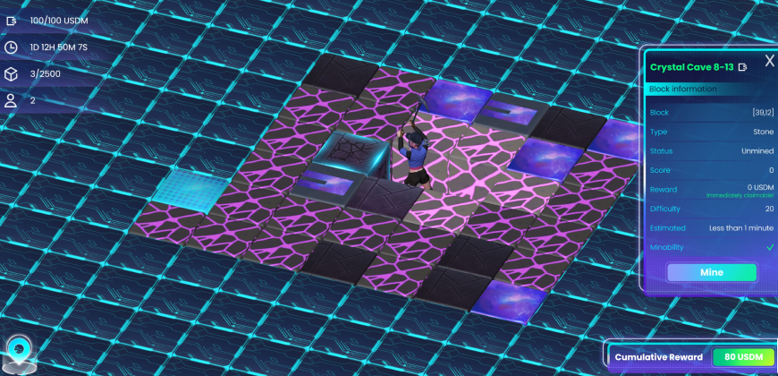
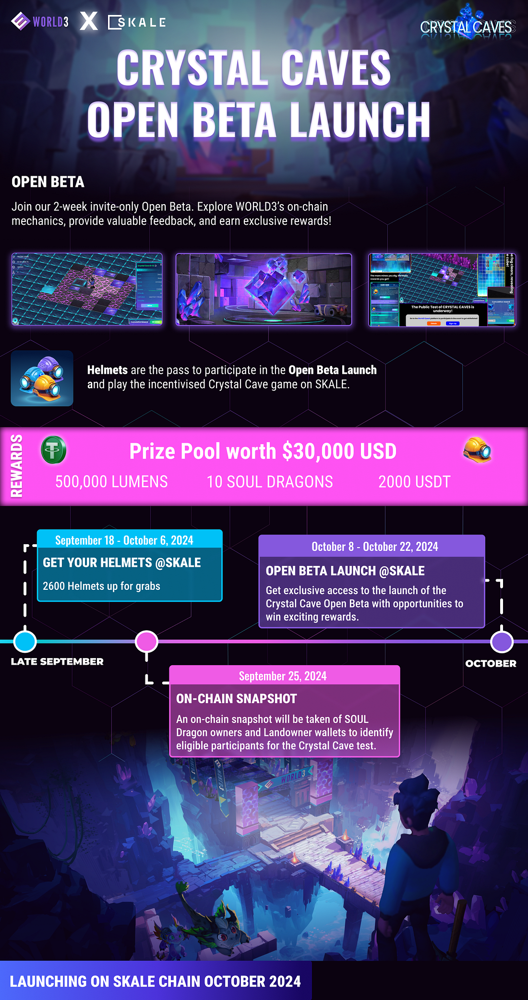

# **Crystal Cave Open Beta Launch with Exclusive Rewards**

## Crystal Cave: Open Beta Launch

Get ready to embark on a thrilling journey with **Crystal Cave**, the first fully on-chain, casual-style mine exploration game where players uncover mine blocks for exciting rewards.

_Crystal Cave: In-game Screenshot_

**Key Features**

- **Casual-Style Mining Experience**: Fun and entertaining gameplay.
- **$30K+ in Rewards**: Earn USDT, SOUL Dragons, Lumens (Lumens are the off-chain utility tokens that converted into on-chain tokens during the [$W3C Airdrop](https://docs.world3.ai/world3/litepaper/tokenomics/lumenomics)) and more!
- **Web & Mobile Support**: Accessible on multiple devices.
- **Advanced Bot Prevention**: Utilizes ZK Proofs & Cryptography for security.
- **Multichain Design**: Crystal Cave is launching on the SKALE chain and has a multichain design.

Note: **We will release the player’s guide containing the instructions to play and mine soon!**

## Open Beta: 2-Week Test

This invitation-only beta test offers a sneak peek into **Crystal Cave** mechanics, providing an opportunity for users to **earn rewards** while helping to refine the game.

Objectives of this test are:

1.  **Showcase On-Chain Mechanics**: Demonstrate fully on-chain algorithms in action.
2.  **Highlight WORLD3 QUEST System**: Engage with on-chain dApps and games seamlessly.
3.  **Gather Community Feedback**: Invite suggestions, bug reports, and participation.

Participants will be **rewarded** with Lumens, USDT and SOUL Dragon Eggs for their involvement.

## How to Participate:

To get started on this mysterious adventure and win exciting rewards, we have created a mini-roadmap for the Crystal Cave Open Beta launch for the community.

_Crystal Cave: Mini Roadmap_

## **1. Get your Helmets @ SKALE**

The Crystal Cave test is about to begin, marking the start of a mysterious adventure. Our collaboration with **SKALE** stems from its innovative zero-gas design, ensuring a seamless user experience. SKALE’s scalable and efficient blockchain infrastructure perfectly aligns with WORLD3’s mission to drive growth within Web3 communities. By eliminating gas fees, SKALE enhances the accessibility and performance of WORLD3’s applications, making it the ideal partner for this ambitious project.

All participants will receive a special reward. Before the cave opens, visit the WORLD3 Quest platform to claim your entry ticket — a special safety helmet. The type of helmet you claim will determine which cave you can explore.Helmets will be distributed to:

- Contest Winners
- QUEST Lucky Draw Winners
- SOUL Dragon Owners
- Landowners

On **September 25, 2024, at 00:00 UTC**, we will conduct an on-chain snapshot of wallets holding SOUL Dragons and WORLD Land, so ensure you own these assets before this date to qualify. All users holding SOUL Dragons and Matrix Lands will be eligible to claim different types of safety helmets.

If you do not own these assets, don’t worry! We’ll be distributing public test qualifications across various communities. You can also complete social media sharing tasks and register your SKALE address for a chance to be selected as a lucky user in an entry qualification airdrop.

**Missed the testing round?** don’t be discouraged! This is just the beginning, and we plan to conduct additional rounds based on the results of this test. Your feedback is valuable, and we want to hear from as many voices as possible in the coming phases.

## **2. Open Beta Launch @ SKALE**

Advancing our [**collaboration with SKALE**](https://skale.space/blog/introducing-world3-the-first-ai-powered-btc-autonomous-world-partnering-on-the-gas-free-skale-network), the Open Beta Launch will be the launch of the Crystal Cave game on the SKALE network. Eligible Helmet holders will gain early access to **Crystal Cave** on the SKALE network. This is a rare opportunity to dive into **Crystal Cave**, experience cutting-edge on-chain gameplay, and earn exciting rewards!

## Prize Pool:

By joining the **Crystal Cave** Open Beta on the SKALE network, you have the chance to win a share of **over $30,000 USD** in rewards. Here’s what’s up for grabs:

1.  **500,000 Lumens:** Valued at approximately **$25,000 USD**, these Lumens can be used within WORLD3 or later converted into valuable assets upon token launch.
2.  **10 SOUL Dragons:** These rare AI companions are currently valued at **2,000 USDT**. Owning a SOUL Dragon grants access to exclusive benefits, such as future airdrops and game advantages.
3.  **2,000 USDT:** Direct cash rewards in **USDT**, the most widely used stablecoin, offering immediate value to participants.

Don’t miss this chance to explore, mine, and win exciting rewards!

In the near future, we’ll be expanding **Crystal Cave** with additional gameplay rounds, integrating support for new blockchain networks, and introducing exciting new reward mechanisms. We’re also working on enhanced gameplay mechanics to create an even more immersive and seamless gaming experience. Stay tuned for these updates as we continue to evolve **Crystal Cave** into a dynamic and rewarding adventure for all players!

## Feedback and Bug Bounty:

We’re committed to delivering an exceptional user experience, and your input is crucial to achieving that. We highly value community feedback and encourage you to share your ideas, suggestions, or any issues you encounter during gameplay.

To make your voice heard, simply use our [feedback form](https://docs.google.com/forms/d/e/1FAIpQLSdjldaf35y4TeXpOuP85t2Y51Z359vAtTV2H7UDPnmhRRWc4g/viewform).

Additionally, we’re launching a **bug bounty program** to reward testers for identifying valid bugs. By reporting issues via the [bug report form](https://docs.google.com/forms/d/e/1FAIpQLSdjldaf35y4TeXpOuP85t2Y51Z359vAtTV2H7UDPnmhRRWc4g/viewform), you’ll have the chance to earn exclusive bounties as a token of our appreciation for your help.

## Notes and Disclaimer:

1.  **Fully On-Chain Experience**: The game is designed to operate entirely on-chain. However, for this test, no real-value assets will be stored in the smart contract, but all gameplay statistics will still be recorded on-chain.
2.  **Rewards**: Rewards will be distributed through the QUEST platform based on in-game performance and participation, linked to specific missions and objectives.
3.  **Official Wallets**: Please use the officially recommended wallets by WORLD3 to participate in the test. The game will be conducted on the SKALE network.
4.  **Beta Test Precautions**: As this is a beta test, we advise creating a new account on the SKALE network for participation. There may be unexpected stops or pauses in the game during the testing phase, but rest assured, your participation and time spent on the test will be recognized and rewarded accordingly.
5.  **Gas-Free Testing**: SKALE is a 0-gas-fee network, and the official faucet ensures you can complete the test without worrying about gas fees.

Prepare for an exciting adventure with the chance to claim your share of a prize pool valued at an impressive **$30,000 USD.** These rewards will be distributed among all participants during the exclusive **Crystal Cave Open Beta**, offering an exciting opportunity to earn while you explore!
