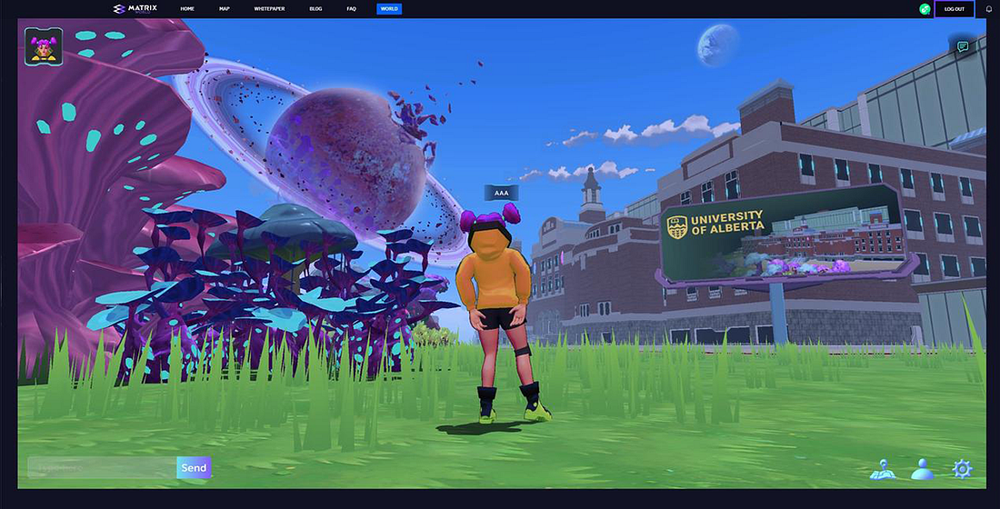
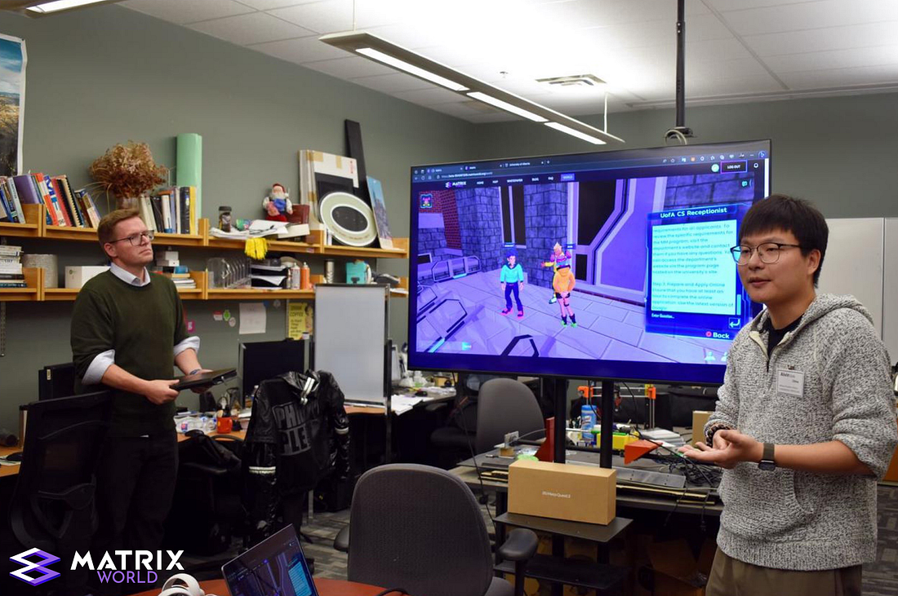
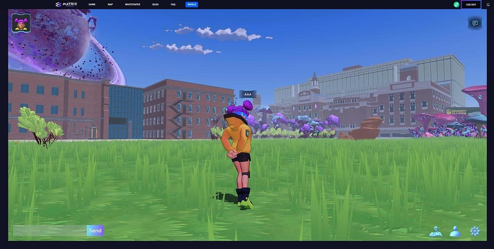
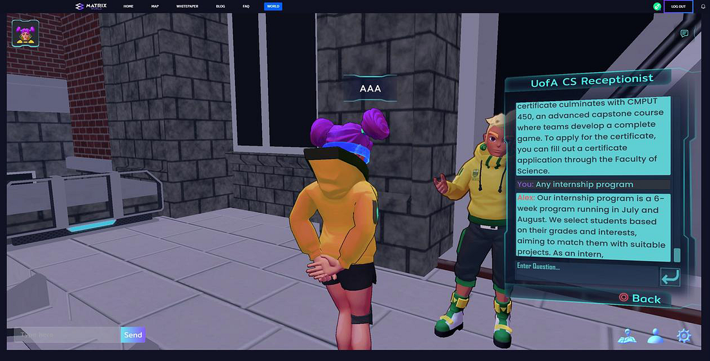
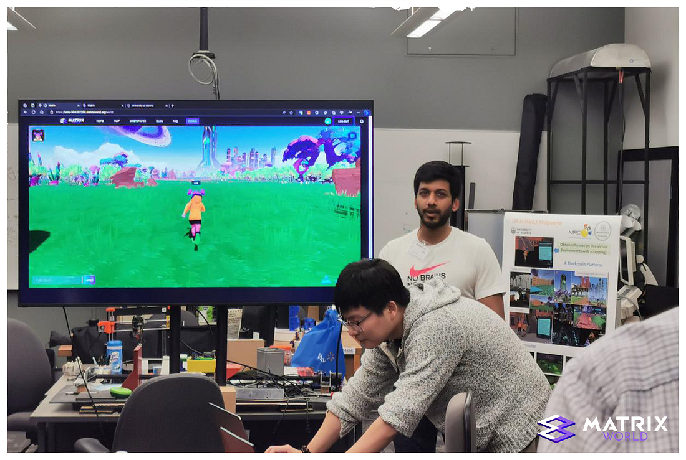

University of Alberta Joins Matrix World’s University Park!

_University of Alberta replica building_

On July 12th, Xinyao (Alvin) Sun, the co-founder and Chief Scientific Officer (CSO) of Matrix World, and Rahul Vyas, a Matrix Labs intern from the Multimedia Research Center, presented Matrix World’s 3D immersive metaverse to various staff members at the University of Alberta (UoA).

As part of the presentation, the team demonstrated two replica University of Alberta buildings, a curated artificial intelligence receptionist, and custom avatar outfits in line with the UoA branding. The attendees included the University President, College Dean, Dean of the Faculty of Science, Associate Dean of Research in the Faculty of Science, and the Chair of Computer Science.

_Xinyao (Alvin) Sun presenting to University of Alberta staff_

This presentation and integration represent part of a bigger vision for Matrix World, as it’s the first building to be added to the new University Park. The University Park aims to provide universities with a means of connecting with students beyond physical boundaries, offering high-quality education worldwide in a flexible, engaging learning environment. Adding the UoA building forms the initial stage of showing how Matrix World can serve as an immersive, interactive, and globally accessible platform for education.

> By integrating a virtual presence for research labs and industry professionals, University Park facilitates direct collaboration between students and the industry. This interaction allows students to work on real-world industry R&D projects as part of their studies, providing invaluable experience and high-quality personnel (HQP) training- Xinyao (Alvin) Sun

_University of Alberta replica buildings_

Through an ongoing relationship between Matrix World and the academic community, notably the [Multimedia Research Center](https://mrc.science.ualberta.ca) at the University of Alberta, coupled with Alvin’s involvement in delivering guest lectures on Blockchain technology since 2019 to the [Multimedia Masters Program](https://www.ualberta.ca/computing-science/graduate-studies/programs-and-admissions/multimedia.html) and Matrix World’s provision of course projects, internships, and job opportunities, it’s fitting to integrate the University of Alberta as the first university into Matrix World.

A key highlight of this tour was the debut of our Artificial Intelligence (AI) ChatBot. This interactive service was custom-built to support the needs of the University of Alberta, answering questions users might have about the Computer Science Department. The team continues exploring ways to use AI in the future builds of Matrix World; landowners will be able to experience the ChatBot in the coming months as we look to add the UoA buildings to the Flow section of Matrix World.

_UofA Receptionist ChatBot_

> The goal of the University of Alberta (UoA) building within Matrix World is to pioneer the next generation of educational experiences by utilizing the potential of 3D web applications. The vision is to create a virtual space that enhances information gathering, presentation, and content creation beyond what traditional 2D web applications can offer- Xinyao (Alvin) Sun

Matrix World will continue working closely with the Multimedia Research Labs to add additional features to the UoA building within Matrix World. The team received feedback during the demonstration from some of the university executive team on potential directions, including integrating real-time data and providing campus tours and demonstrations.

_Xinyao (Alvin) Sun and Rahul Vyas demonstrating inside Matrix World (pictured Flow HQ)_

The team hopes this can serve as an example of what is possible in the world, not limited to education alone, inspiring other sectors to explore how to step into their own 3D environment and establish a deeper connection with their community.

**About Matrix World**

Matrix World, inaugurated in 2021 by its parent company Matrix Labs, stands as one of the first multichain metaverses of its kind. Matrix World was conceived with a focus on accessibility, therefore not confining developers and end-users to a single blockchain. Each parcel is powered by its unique computational capabilities and storage resources, giving users complete control over what is constructed and the lifecycle of the objects on their land. In February 2022, Matrix World successfully secured $5.5M from 17 investors during an angel-round funding at a $50M valuation, thereby strengthening the growth and development of the Matrix World project.

**To learn more about Matrix World or get in contact, please visit the links below:**

[Website](https://matrixworld.org/home)  
[Twitter](https://twitter.com/theMatrixWorld)  
[Telegram chat](https://t.me/MatrixWorldM)  
[Discord](https://discord.gg/UW5rx3FzMD)
