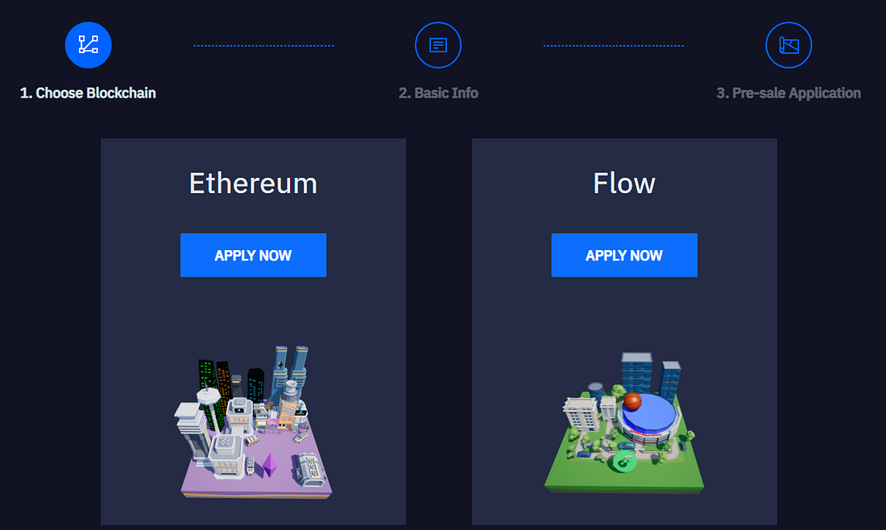
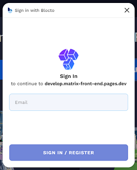
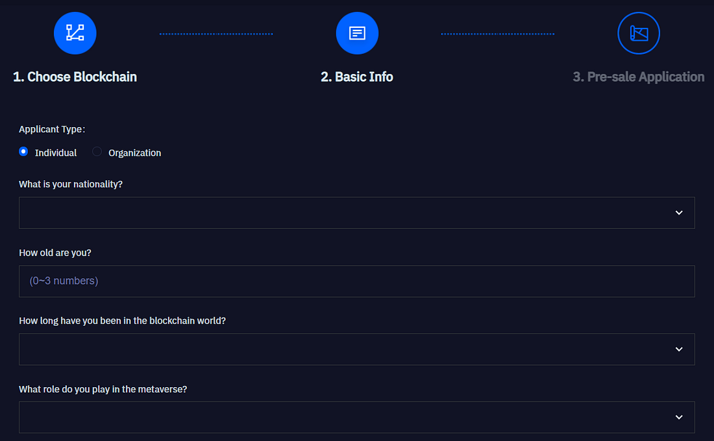
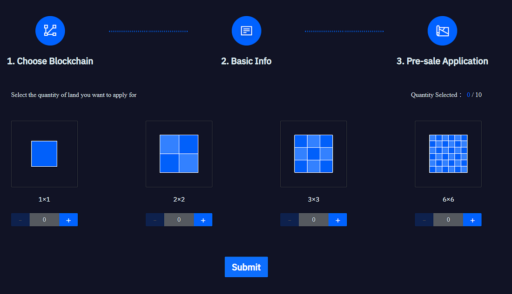
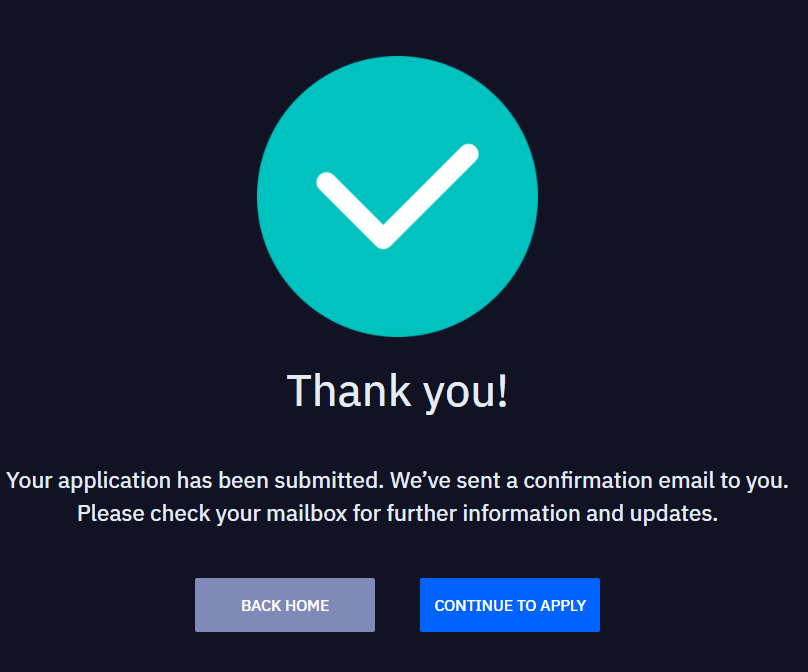

Applications for Matrix Land(s) pre-sale start from today (10/10/21) at 09:00 AM PDT. After evaluating all the submission, up to 2000 Lands on Ethereum would be offered in Round 1 on Oct 15, up to 5000 Lands would be offered on Flow blockchain in Round 2 on Oct 26, and up to 3000 Lands would be offered on Ethereum blockchain in Round 3 on Nov 08.

There are two types of applications for Land pre-sale, individual applicants and organizations. All the details for both types of applicants are given below. Please note that Matrix Land community pre-sale is an activity for metaverse builders and lovers. You may get fewer Lands than what you apply for because we want to get more builders into the Matrix World ecosystem.

**Individual Applicants  
**Individual applicants can apply for up to 10 Matrix Lands in the community pre-sale.

**Organizations  
**Organization members can apply for up to 108 Matrix Lands in the community pre-sale.

**Prerequisites  
**On Ethereum, we support [Metamask](https://metamask.io/) and all other wallets integrated with web3.js. On Flow, we support Blocto, which is a wallet for Flow.

**Steps  
**There are following steps to apply for Land(s) in pre-sale.

1.  Choose Blockchain
2.  Fill in the basic information
3.  Choose your desired land size and quantity, and submit the application.

**Choose Blockchain  
**The first step is to choose the blockchain on which you want to mint your Land, there are two blockchain options for now which are Ethereum and Flow.

If you choose Blocto, you’ll create your account using your email address, and a password would be sent to your email address, after verification you would be eligible to apply for Land in Matrix. After successful registration, a Flow blockchain address would be assigned to the applicant against email-address.

Once you have created your account using either MetaMask or Blocto, the second step is to fill in the basic information such as shown in the figure below.

**Fill in the basic information  
**once applicant have selected the blockchain, the next step is to fill in the basic information such as age, nationality, etc., as shown in the figure below

**Choose your desired land size and quantity, and submit the application  
**Once you have filled all the information, the next and last step is to choose the Land(s) and size you want to apply for, as shown in the figure below.

There are different sizes of Land(s) available for pre-sale which are 1\*1, 2\*2, 3\*3, and 6\*6. And you have choice to select multiple Land(s) of different sizes also. After you have selected Land(s) of your requirements, simply click the ‘Submit’ button, and your application would be submitted and you would be notified about the results through email as well as from our website.

**Important Information**  
_In 1st round 2000 Lands would be offered on Ethereum, each Land would cost only 0.2 ETH to mint and for Flow users, the price is the same, but the payment is via FUSD or FLOW at the community pre-sale stage.  
The selected applicants from the 1st round would receive an email on 15th Oct, and they will have 72 hours to mint offered Land(s) after receiving the email.  
The selected candidates from 2nd round would be notified on 26th Oct  
The selected candidates from the 3rd round would be notified on 8th Nov.  
Candidates, who are not selected for the 1st round, don’t need to worry, will still have a chance. There’re chances for the applicants who are not selected in 1st round to be selected in 2nd or 3rd round._

Selected applicants would obtain Land Voucher(s) which is basically a land certificates. This voucher is used to prove the land information, location and size you obtained during the pre-sale stage. Most Land Token is a proof of the prototype of the land in Matrix World.  
For more information, you can also refer to our FAQ

1. https://matrixworld.org/faq and production
2. https://matrixworld.org/home.

**Contact Us**  
If you face any problems or have any questions, please find us on the below given links, our team will respond your quires ASAP

\-Website: [https://matrixworld.org/](https://matrixworld.org/)  
\-Telegram: [https://t.me/joinchat/26ov1EJ6Ln82MjI1](https://t.me/joinchat/26ov1EJ6Ln82MjI1)  
\-Twitter: [https://twitter.com/theMatrixWorld](https://twitter.com/theMatrixWorld)  
\-Discord: [https://discord.gg/bMQh4ztyhP](https://discord.gg/bMQh4ztyhP)

Thanks for your interest in Matrix, we’ll keep continue introducing new and amazing features, and we’ll keep you updated.
