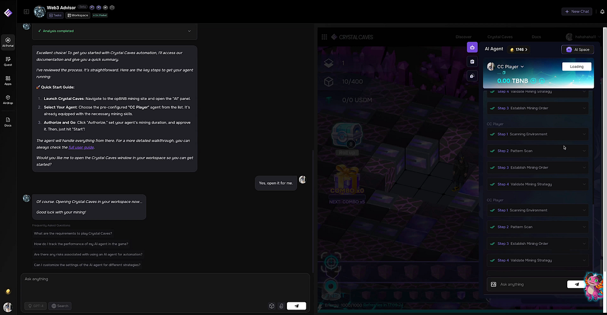

*24/7 AI Agents for Web3 Automation*

The world of Web3 is complex and rapidly changing. Prices fluctuate by the second, protocols and services emerge endlessly, and rules shift without notice. In this volatile environment, users must constantly adapt to new information and piece together different tools to achieve their goals. But now, things have changed.

Our newly released 4-minute WORLD3 demo video shows exactly how AI Agents can explore, analyze, and execute within this complex Web3 landscape on your behalf. The redesigned WORLD3 website is currently in its beta stage for final testing, with these powerful capabilities set to roll out soon — bringing the future of automated Web3 to your fingertips.

Watch the full 4-minute demo here: [WORLD3: Automating Your Web3 Adventure with Long-Lived Expert Agents](https://youtu.be/Doxn953GdA4?si=QFCFKL84d5QxYrAI)

## From Concept to Live Action

Many Web3 projects promise the future with flashy roadmaps and conceptual explanations, but users are still left wondering, “What can I do right now?” The new WORLD3 4-minute demo video gives a direct, clear answer to that question. The agents featured in the video are real, functional capabilities available on the platform at this very moment — not just demo props. In that sense, this video is not about a future vision, but about technology that’s already running today.

## A Safe and Efficient Start for Web3 Beginners

The video opens with a new user calling the Web3 Advisor Agent. When asked about “profitable opportunities,” the Agent instantly taps into WORLD3’s knowledge base, analyzes the data, and recommends *Crystal Caves*, a fully integrated on-chain game. The game tutorial follows, and with a single click, a dedicated gaming agent is deployed.

*Web3 Advisor plans Crystal Caves automation*

This agent reads real-time on-chain data, selects the optimal mining strategy, and takes action — rewards start accumulating immediately. Importantly, it doesn’t just follow commands; it adapts its strategy as the game evolves. This demonstrates that even complete Web3 beginners can take their first steps safely and efficiently with WORLD3 Agents.

## Automating Complex Asset Management

The next scene shows managing assets across multiple chains. The user holds USDC on two chains and requests a conservative investment strategy. The Trading Agent doesn’t rush into execution — it begins by asking clarifying questions to fully understand the user’s needs.\
It then securely checks the wallet’s assets, analyzes real-time on-chain data, and finds the highest-yield opportunities suitable for that profile. After presenting a tailored strategy and receiving approval, the agent connects directly to the protocol and executes smart contracts. From strategy design to execution and monitoring, the entire process is automated — showing how WORLD3 Agents can fully replace professional asset management.

*Investment Agent develops a strategy*

## From Idea to Execution — Bringing New Projects to Life

Midway through the video, you’ll see how a completely new idea becomes reality. The example is a “decentralized VPN” service. The DocuWriter Agent goes far beyond drafting text — it conducts market analysis, competitor research, and technical requirement reviews to produce a professional-grade whitepaper. This whitepaper is saved as a “smart artifact” that other agents can directly use.\
Once passed to the Web3 Dev Agent, the agent fully understands the vision and immediately creates an execution plan. The result is clean, production-level code and a fully functional website. What could take a human hours or even days — from document creation to product launch — takes only minutes with the help of WORLD3 Agents.

## Community Growth and Market Entry

The completed product is then handed over to the Influencer Agent. Using the whitepaper as a foundation, it develops a marketing strategy, seeks approval, posts content, engages with key figures, and tracks performance. This is not simple scheduled posting — it’s intelligent campaign management from strategy to execution.

## The Architecture That Makes It All Possible

The video closes by introducing WORLD3’s unique architecture. Designed with a modular structure, the platform can infinitely expand the Web3 universe by combining new Skills and Knowledge Packs. Every agent runs on the cloud-native WORLD VM, performing long-term operations and adapting to any Web3 scenario.\
This is not just a list of features — it’s a structural design that unifies the entire Web3 landscape into one fully automatable environment.

*All-in-One Web3 Automation with Expert AI Agents*

## An Evolved WORLD3 Website — What’s Changed

The biggest shift in this redesign is toward a *platform-first experience*. Where the old site focused on feature introductions and documentation, the new site puts agent creation and execution front and center from the very first screen. The design is far more intuitive and user-friendly, with key enhancements:

- **Instant Execution Environment:** The UI now lets you create and run the exact agents you saw in the video immediately.
- **Integrated Marketplace:** Explore agents in categories like gaming, trading, and data analysis. Easily rent or purchase agents created by other users.
- **Real-Time Feedback:** A new dashboard shows each agent’s progress and performance in real time.
- **Simplified Onboarding:** New users can follow an intuitive guide to launch and test agents without complex setup steps.

This transformation elevates WORLD3 from a simple Web3 automation tool to a true web3 productivity platform. Users no longer wonder *“What’s possible?”* — instead, they can focus productively on *“What should I do?”* and execute instantly.

Now that you’ve seen what WORLD3 Agents can do, experience it visually in our short video demo.

## Conclusion — Now Is the Time to Start

This short video condenses all of WORLD3’s core capabilities into one compelling showcase. The real value lies in experiencing them directly on the updated platform.\
Instead of spending time and effort trying to understand and react to the complex Web3 environment, you can simply let AI agents handle it and check the results. WORLD3 has already made this transition a reality — and now is the moment for you to make it your own.

The next generation of WORLD3 Agents will be even smarter and more creative, going beyond repetitive tasks to uncover new opportunities, predict market shifts, and connect users worldwide into a network of shared, ever-evolving agents. Today’s WORLD3 is the first step toward that vast future, and every user who joins now becomes a co-creator of that change.

This demo video shows the truth in a way anyone can understand.

The automated Web3 world is no longer the future — it’s here, it’s live, and you can join the journey with just one click.
