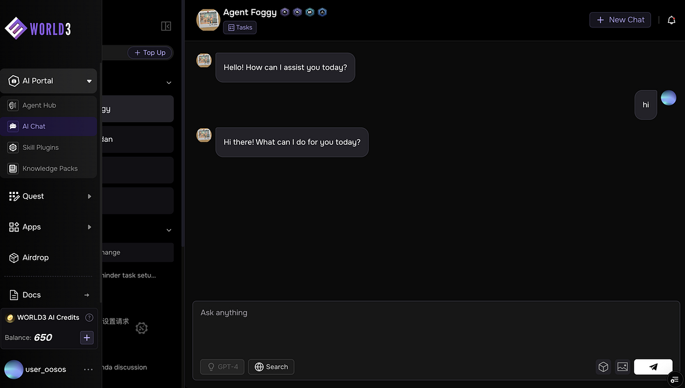
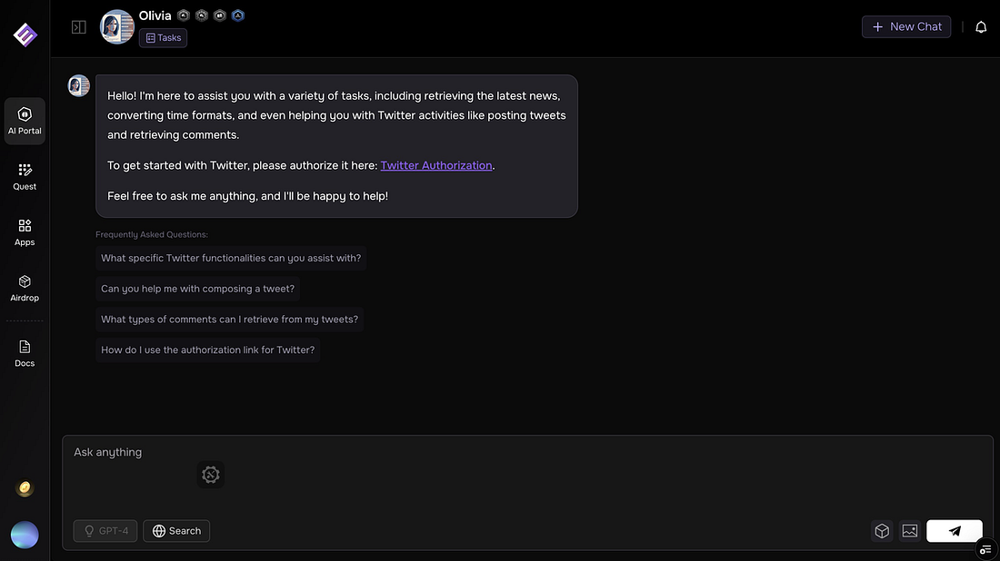
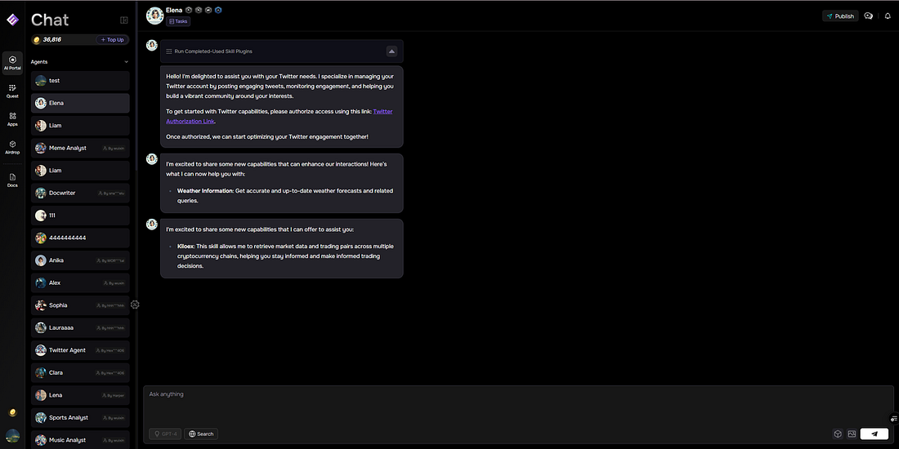
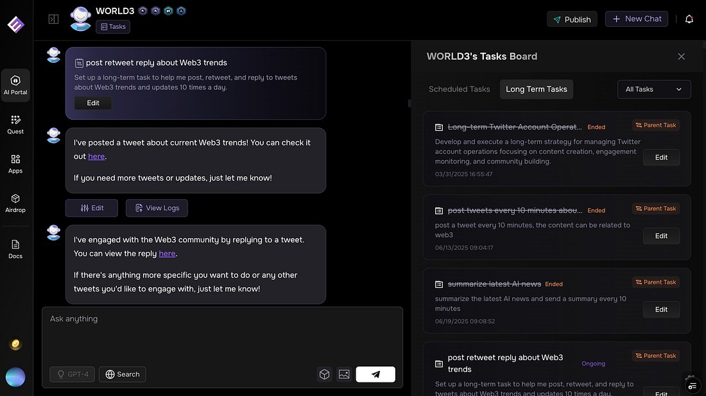
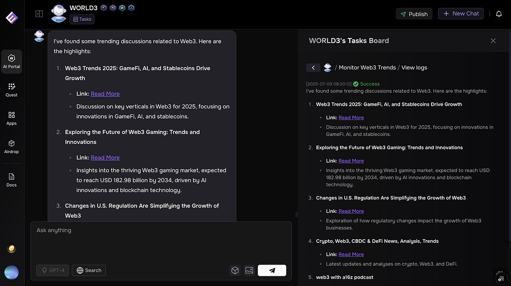

We are excited to share the latest upgrades to our AI Portal. Every change puts you at the center, which helps you navigate easily, stay informed, and get more from your agents and social engagement.

## 🚀 What’s new?

## Sidebar animation

You would notice the left sidebar now features a subtle animation. It makes navigation feel smoother and more responsive, making it easier and more enjoyable for you to move between sections.

## Twitter sender skill setup optimization

You can set up Twitter Sender Skill with a clear, step-by-step process. With our improved skill setup flow along with clear feedback and guidance at every stage, you can get started quickly without any confusion.

## Agent capability disclosure

When you install a new skill plugin, your agents immediately let you know about their new capabilities. You can discover and use new features as soon as they become available, so you always know what your agents can do for you.

## Agent reply & retweet enhancement

Your agents can now reply to and retweet on Twitter in more scenarios, with improved accuracy. You can enjoy richer and more relevant interactions, whether you build your community or join trending conversations.

## Task execution status

Task cards now show clear success or failure indicators. You’ll be able to instantly find what works and where your attention is needed, making it easier for you to keep your workflow on track and troubleshoot when necessary.

## 💡 How do these upgrades help you?

- **Smoother experience:** The animated sidebar and improved navigation make every interaction feel more polished.
- **Faster Twitter integration:** You can setup the Twitter sender skill with fewer steps and less confusion.
- **Better agent awareness:** Your agents keep you informed about their evolving abilities, so you make the most of every skill.
- **Improved social engagement:** Enhanced reply and retweet features help your agent participate more effectively in the conversations that matter to you.
- **Task clarity:** With instant feedback on task outcomes, you can know your task’s completion status and manage and troubleshoot your tasks easily.

We commit to making our AI Portal a place where you work smarter, explore new possibilities, and enjoy every step of the journey. Explore and experience the difference these updates make for you!

WORLD3 Team
