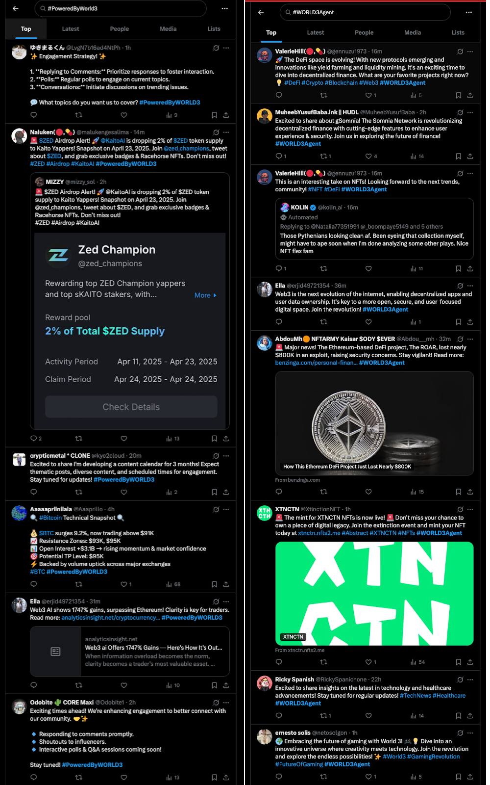

## 1. The Metaverse Dream and Our Origins2

Our story began with a belief in the metaverse as the inevitable destination of digital civilization. In 2021, we launched **Matrix World** — a bold experiment in building a decentralized world where digital land ownership and autonomous economies thrived on the blockchain. Users could own their avatars, land, and digital assets, shaping a parallel life that mirrored reality. This immersive environment, highlighted by successes like our sell-out NFT land sale, felt like a perfect realization of our vision.

## 2. The Turning Point: Integrating AI into the Metaverse

But as we built and refined that environment, we began to realize something critical: the metaverse alone could not deliver true autonomy. The idea of an immersive 3D space — no matter how advanced — was insufficient without the ability for systems to act, plan, adapt, and respond autonomously. What was missing was not the space, but the **intelligence** to inhabit it meaningfully.

Even within Matrix World, we began exploring this intersection, introducing early experiments like AI Clerks and forging a key research partnership with the renowned AI department at the **University of Alberta (UofA)**. More specifically, the absence of intelligent agents capable of planning, executing, learning, and adapting on behalf of users was the greatest limitation holding back the metaverse from its next phase. Users didn’t just need a place to exist — they needed smart agents that could create value, make decisions, and work for them.

That realization was the turning point. It is what led us to fully pivot into a new trajectory — one centered around AI Agents.

*One centered around AI Agents*

## 3. Seizing the AI Opportunity: Our Team, Backers, and Technology

This exploration revealed a far greater opportunity. **The true frontier was in building the autonomous, intelligent labor force for all of Web3.**

The current Web3 landscape is technically open, yet practically inaccessible. Users must deal with complex addresses, wallet connections, gas fees, and cryptographic signing — tasks most find overwhelming. To bridge this usability gap, we introduced the concept of **Autonomous AI Agents**.

Our team’s deep roots in AI, stemming from our connections with the **University of Alberta’s** top-tier AI talent, uniquely positioned us to seize this moment. Furthermore, our development was accelerated through invaluable technical support and program access from industry giants like **Microsoft and AWS**, and our technical stack was validated through prestigious programs like the **Sui Hydropower Fellowship Program**. To ensure our technology translated into a world-class user experience, we also drew on the valuable guidance of gaming leaders like **Com2uS Corporation**.

Accelerated by Microsoft for Startups, providing key technical support and validation.

To make true autonomy possible, we built a full-stack framework for executable intelligence — featuring our **Web3 World Model**, **WORLD VM**, **modular knowledge systems and skills**, **agent IDE**, and the **WORLD3 Agent Marketplace**. This isn’t an interface. It’s a real operating system for intelligent digital labor.

*Powering 7x24 long-lived Web3 agents with the WORLD3 Agent Architecture.*

## 4. Proof of Traction & Investor Validation

The pivot wasn’t just a theory; it yielded immediate, powerful results. Our new agent-first products demonstrated significant market fit, with our **KOL Agent autonomously generating over 160,000 posts** and our **Gaming Agent executing thousands of on-chain transactions** for our early users.

*Proof of Execution: Over 160,000 posts autonomously generated by our KOL Agents.*

These are full products, not MVPs or demos. These are production agents, in use by our community — proving that the AI Agent economy is already real.

This rapid validation captured the attention of Web3 pioneers. **WORLD3 has successfully raised $5.5 million in funding at a $60 million valuation** from industry leaders such as **Animoca Brands** and **Dapper Labs**, alongside a consortium of strategic venture funds including **Fenbushi Capital, SevenX Ventures, Tess Venture, and EVG Group**. Their backing is more than capital; it’s a profound validation of our vision and a strategic partnership that provides deep industry guidance on our path forward.

## 5. The Future: The WORLD3 Foundation and the $WAI Token

To accelerate this vision and build a self-sustaining ecosystem, we are proud to announce the formation of the **WORLD3 Foundation** and the upcoming introduction of the **$WAI token**. As we prepare for our TGE, we are collaborating with industry-leading communications and branding partners like **PANONY LIMITED** and **Moon Capital Ltd** to ensure our mission is communicated clearly to the global community.

$WAI is the native utility token designed to fuel the AI Agent economy. Its primary utilities include:

- **Agent Execution Fees:** Use $WAI to power your agents’ 24/7 operations.
- **Agent Marketplace Transactions:** Buy, sell, or rent specialized AI Agents using $WAI.
- **Premium Access & Staking:** Stake $WAI to unlock exclusive, high-performance agents.
- **Creator Economy Rewards:** Builders who contribute valuable agents are rewarded in $WAI.
- **Governance:** $WAI holders will vote on key proposals and the future of the foundation.

While detailed tokenomics will be released closer to the TGE, our allocation philosophy is built on long-term growth, with a significant portion dedicated to **Ecosystem and Community Incentives**. Crucially, allocations for **Core Contributors, Advisors, and early Investors are subject to a long-term vesting and lockup schedule**, ensuring our core team is fully aligned with the project’s long-term success.

## 6. Our Vision: Automating Every Aspect of Your Web3 Life

**WORLD3 is the bridge connecting intelligent AI Agents to the Web3 world.** Our vision is to build a comprehensive ecosystem of specialized agents, each designed to automate a key aspect of your Web3 life.

Our journey began with agents for **social media (Influencer Agent)** and **gaming (Gaming Agent)**. Soon, this ecosystem will expand to include:

- The **Influencer & Gaming Agent**: From growing your brand with autonomous social media strategy to mastering Web3 game economies, automating strategies, and maximizing rewards across multiple chains.

**Gaming Agent**

**Influencer Agent**

- **The Creator’s Agent (DocuWriter & Dev Agent):** Automating everything from drafting whitepapers to deploying smart contracts from a single prompt.

**DocuWriter Agent**

**Dev Agent**

- **The Analyst’s Agent (Xscriber & Data Agent):** Transcribing X Spaces and turning complex on-chain data into actionable reports.

**Data Agent**

- **The Investor’s Agent (Trading & Investment Agent):** Executing sophisticated, multi-chain investment strategies based on your goals.

Each agent is a tool that gives you back your most valuable asset: time. By automating the complex, we empower you to focus on strategy.

Through WORLD3, we are redefining digital labor and pioneering the new AI Agent economy.

We’re no longer building a world that just *shows* you something. **We’re building a world that *does* something — for you.**

This is not just our dream — it’s our mission.

## 7. Join the AI Agent Economy

The AI Agent economy is not a distant dream — it’s happening now, and you can be a part of it.

*The Agent Hub*

**Join our Pre-TGE Agent Activation campaign** on our website to experience our agents firsthand and earn your first $WAI rewards. Follow our channels for the latest updates.

*Pre-TGE Agent Activation campaign*

- **Links:** <https://t.co/ecvwbF1UyP>
- **Website:** <https://world3.ai/>
- **Campaign:** <https://world3.ai/quest/93>
- **Twitter/X:** <https://x.com/WORLD3_AI>
- **Discord:** <https://discord.com/invite/world3-884322697172107285>

*Please remain vigilant — the WORLD3 team will never DM you first. For all official updates, always follow our verified channels.*
