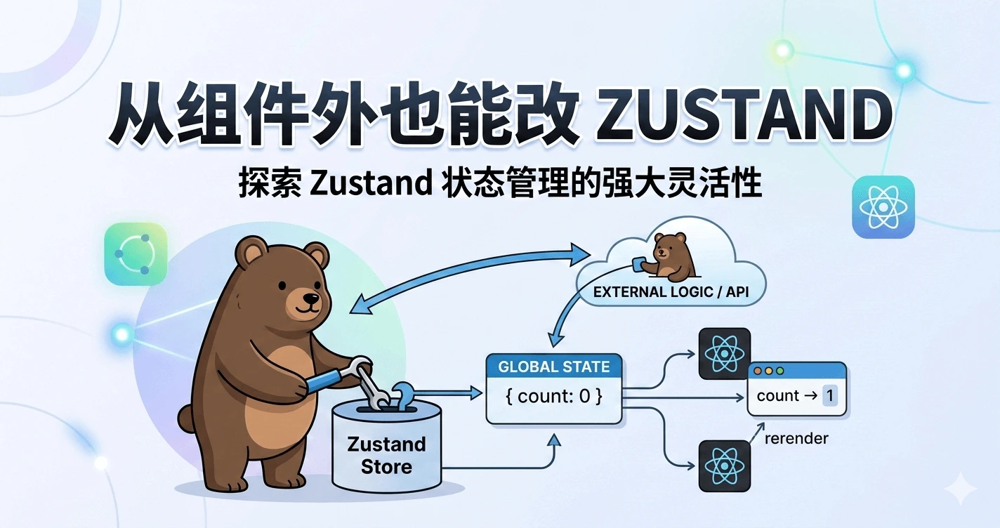

这次对 Zustand 的理解升级，其实是从一个很简单的问题开始的：

> 为什么我可以在组件外面通过 `store.getState().setXXX()` 修改状态，而且组件里的值还能自动更新？

一开始我一直以为 Zustand 是基于 React Context 实现的。既然是基于 Context，那它应该只能在组件树里用，离开组件就没法工作。但实际测试下来发现：

- 在组件外调用 `.getState().setXXX()` 完全没问题

- 组件内通过 `useStore(selector)` 订阅的值也会自动更新

- 根本不需要 Provider（在默认用法下）

这让我意识到，我对 Zustand 的理解是错的。

---

## 一、Zustand 不是基于 React Context

很多人（包括我）会自然地把“全局状态管理”跟 React Context 绑定在一起。

但 Zustand 的默认实现，其实完全不依赖 React Context。

如果你这样创建一个 store：

```typescript
export const usePluginStore = create<PluginState>((set, get) => ({
  ...
}));
```

这个 `create()` 做的事情本质上是：

- 在内存里创建一个 store 对象

- 这个对象内部维护：

  - 当前 state

  - 一组 listeners（订阅者）

  - getState

  - setState

  - subscribe

它本质上更像一个带发布-订阅能力的状态容器。

---

## 二、Zustand 的核心：发布-订阅模型

可以把它想象成这样一个结构：

```typescript
const store = {
  state: {...},
  listeners: new Set(),

  getState() {},
  setState(partial) {
    this.state = {...this.state, ...partial}
    this.listeners.forEach(listener => listener())
  },
  subscribe(listener) {
    this.listeners.add(listener)
    return () => this.listeners.delete(listener)
  }
}
```

重点在于：

- `setState()` 会通知所有订阅者

- 组件通过 `subscribe()` 注册自己

- 一旦状态变化，所有订阅组件都会被触发更新

这跟 React Context 的“向下传递”机制完全不是一回事。

---

## 三、那组件是怎么更新的？

答案是：`useSyncExternalStore`

从 React 18 开始，React 提供了一个专门用于订阅外部状态的 API：

```typescript
useSyncExternalStore(subscribe, getSnapshot)
```

Zustand 内部的 `useStore(selector)` 本质上就是：

```typescript
useSyncExternalStore(
  store.subscribe,
  () => selector(store.getState())
)
```

也就是说：

1. 组件挂载时注册订阅

2. 当 store 触发 `setState`

3. 所有 listener 被调用

4. React 检查 selector 的返回值是否变化

5. 变化则重新渲染组件

所以组件更新根本不依赖 Context，而是依赖订阅机制。

---

## 四、为什么组件外也能调用？

因为 store 本身是一个普通的 JS 对象，存在于模块作用域中。

```typescript
usePluginStore.getState().setCcSkillInstalled(false);
```

这行代码只是：

- 拿到当前 store

- 调用内部的 setState

- 触发所有订阅者

和你在组件里调用没有本质区别。

这也是 Zustand 和 Redux 的一个相似点：它们本质都是“外部状态容器”，而不是“React 专属状态”。

---

## 五、Provider 到底是干嘛的？

默认情况下：

```typescript
const useStore = create(...)
```

这个 store 是一个全局单例。

但如果你使用的是：

```typescript
createStore() + Context + Provider
```

那只是为了：

- 支持 SSR（避免多用户共享一个单例）

- 支持多实例 store

- 做更强的隔离

本质还是同一个发布-订阅模型，只是把 store 实例放进了 Context。

---

## 六、关于命名的一个误区

`usePluginStore` 这个名字确实有点迷惑。

因为它看起来像一个“只能在组件内调用的 hook”。

但实际上它：

- 既是一个 hook（可以 `usePluginStore(selector)`）

- 也是一个 store API（可以 `.getState()`）

这也是 Zustand 的一个设计特点：一个函数，两个角色。

如果想更清晰，可以：

- 导出 `pluginStore`（vanilla store）

- 再导出 `usePluginStore`（React 订阅层）

但它们共享同一个状态源。

---

## 七、我的理解总结

现在我对 Zustand 的理解变成了这样：

> Zustand 是一个独立于 React 的状态容器，实现了发布-订阅模型；React 只是通过 useSyncExternalStore 订阅它的变化。

换句话说：

- Zustand 的 store 本身就是内存里的一个对象

- 状态挂在这个对象内部

- setState 会通知所有订阅者

- React 只是其中一种订阅者

这也解释了：

- 为什么组件外可以更新状态

- 为什么不一定需要 Provider

- 为什么它性能很好（没有整棵树的 context 传播）

---

## 结尾

这次最大的收获不是“怎么用 Zustand”，而是意识到：

不要因为它有 `use` 前缀，就默认它是基于 React Context 的 Hook 方案。

它其实更接近一个轻量级状态引擎，而 React 只是它的一个适配层。

有时候理解一个库的底层模型，比记 API 更重要。
