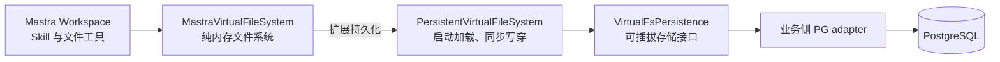
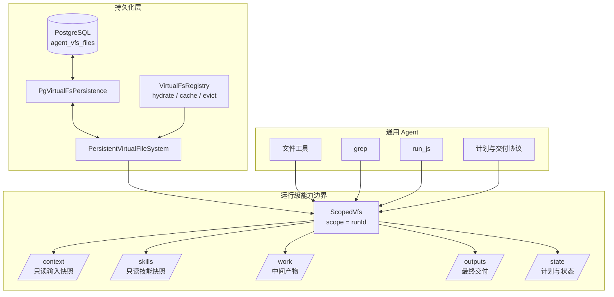
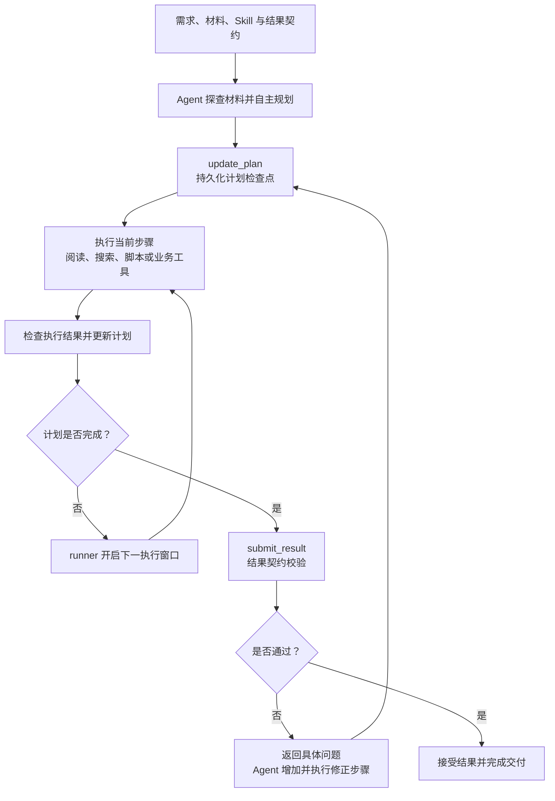
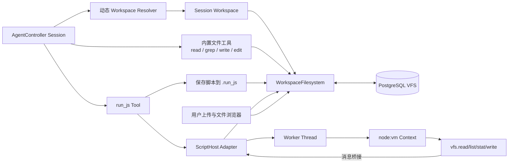
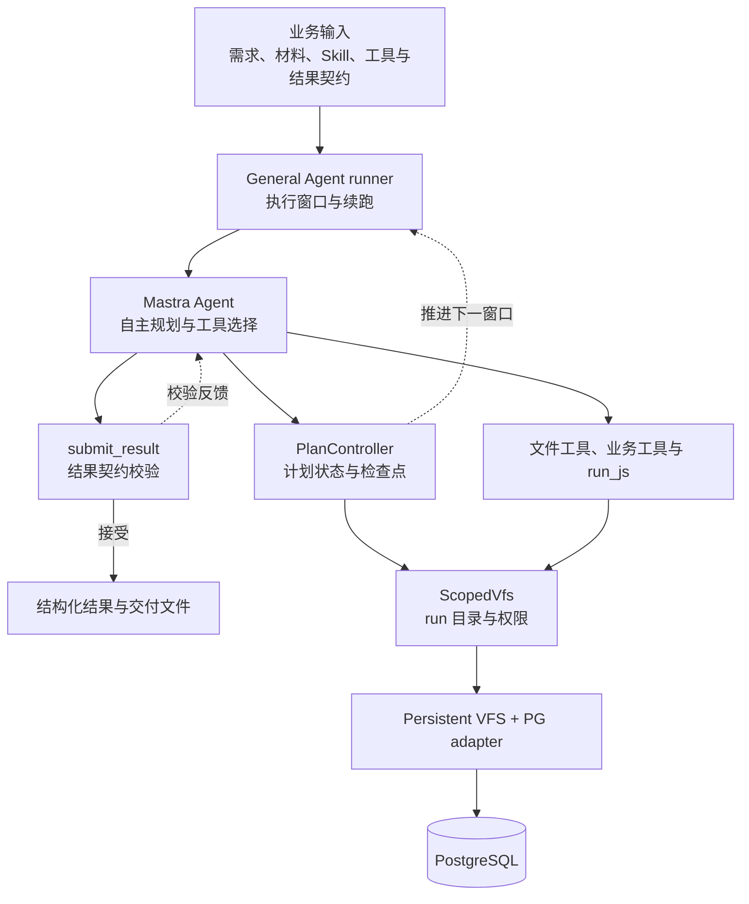
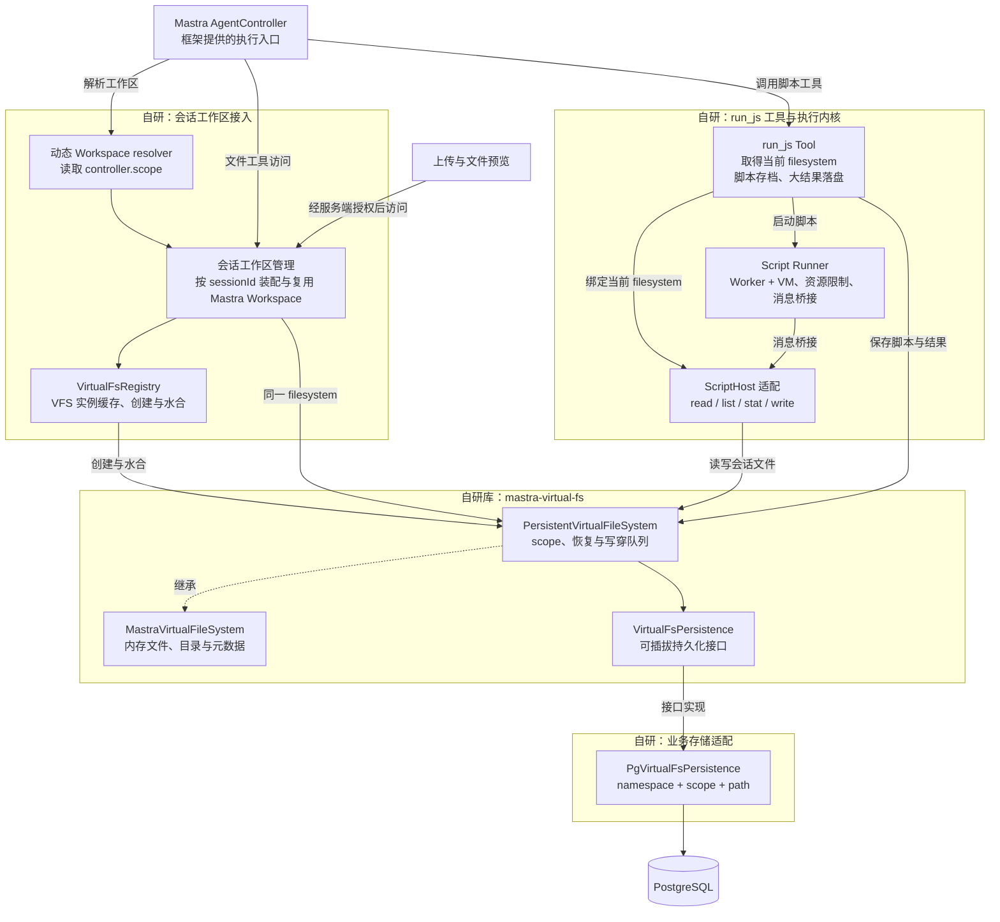

让 Agent 完整读取 60 集剧本、生成资产附录、运行覆盖校验，并在用户中途调整需求后继续工作，需要解决的不只是模型调用：材料放在哪里，中间结果怎样保留，脚本如何处理这些文件，多次执行又如何共享同一份任务状态？

为此，我基于 **Mastra + PostgreSQL + Node.js** 自研了一套持久化 Agent 执行环境：用 `mastra-virtual-fs` 提供可持久化的虚拟文件系统，用 `ScopedVfs` 限制运行级文件访问，用 AgentController 管理多轮会话，再通过自定义 `run_js` 为 Agent 提供 JavaScript 批处理能力。

这套方案的特点是：**文件按会话持久化，计算按调用执行，所有读写共享同一工作区。** 它不需要为每个会话启动完整 Linux 环境，就能支持材料阅读、文件生成、批量统计和交叉校验。具体分工如下：

- **存储与计算分离**：文件由 PostgreSQL 持久化，`run_js` 在 Worker Thread + `node:vm` 中执行短脚本；一次脚本结束不会带走任务文件。
- **工作区随任务延续**：Controller 按 Session scope 动态解析 Workspace，让后续对话和中断后的新一轮执行继续访问已有产物。
- **统一文件访问**：用户上传、文件预览、Agent 文件工具和 `run_js` 读写同一份 VFS，脚本与大结果也会存档，便于回查和校验。

它适合以文本和结构化数据为主的长任务，当前执行内核不提供 Shell、依赖安装或不可信代码的强隔离。下文从 `mastra-virtual-fs` 的开发开始，介绍通用 Agent、Session 工作区和 `run_js` 如何逐步组成这套方案，以及各层的设计取舍。代码为简化示意。

## 一、mastra-virtual-fs：从内存文件到持久化

`mastra-virtual-fs` 最初用于将动态生成的 Skill 正文和 references 直接提供给 Mastra，避免创建和清理临时磁盘目录。

Mastra 的 Skill 系统通过 Workspace filesystem 读取内容。[`mastra-virtual-fs`](https://github.com/Hexi1997/mastra-virtual-fs) 在内存中实现 `WorkspaceFilesystem`，通过 `seedSkill()` 注入内容，复用框架原有的 Skill 和文件工具。

随着文件开始承载计划、报告和中间结果，`PersistentVirtualFileSystem` 扩展了持久化能力：启动时从存储加载文件，读取走内存，写入先更新内存，再等待持久化完成。SDK 只定义存储接口，PostgreSQL adapter 和表结构由业务项目实现。



业务侧另设 registry 管理实例，以 `namespace + scope + path` 定位文件。当前实现不自动同步跨进程缓存，也不在落库失败时回滚内存，需要上层控制写入者和恢复策略。

## 二、Scoped VFS：运行隔离与目录权限

第一版通用 Agent 需要保护原始材料，同时允许生成中间文件和结果。`ScopedVfs` 在持久化 VFS 外提供运行隔离与目录权限，将逻辑路径映射到当前 run 的目录：

```text
/context/episodes/01.md
        ↓
/runs/run-abc/context/episodes/01.md
```

每次运行只允许访问五个逻辑根目录：

| 目录 | 用途 | Agent 是否可写 |
| --- | --- | --- |
| `/context` | 本次任务的输入材料快照 | 否 |
| `/skills` | 本次运行加载的技能与说明 | 否 |
| `/work` | 中间文件、脚本和临时结果 | 是 |
| `/outputs` | 最终交付物 | 是 |
| `/state` | 计划、进度和机器可读状态 | 是 |

`ScopedVfs` 会拒绝 `..`、反斜杠、NUL 字符以及未授权的根目录；`/context` 和 `/skills` 只能在 Agent 启动前由 runner 写入快照，Agent 本身不能修改。

读写权限由文件系统层强制检查，底层持久化库无需包含业务目录规则。



## 三、通用 Agent：自主规划、执行与迭代

通用 Agent 在 Mastra 的工具调用循环外增加了计划管理、执行检查点和结果校验机制。Agent 理解需求、制定计划、选择工具，并根据执行和校验结果调整后续行动。业务方提供需求、材料、Skill、业务工具，以及可选的结果契约，无需预先编排每一步。

这里的“通用”主要体现在执行流程的复用。剧本资产提取、文档分析和内容审核可以使用不同的材料与规则，共用同一套计划管理、检查点、续跑和结果提交机制。

### 计划由 Agent 生成，状态由代码管理

复杂任务先探查材料，再通过 `update_plan` 建立计划。任务拆成几步、是否分批、每批处理多少内容，都由 Agent 根据输入决定。简单的一步任务可以直接完成；配置了结果契约的任务则必须先建立计划。

计划保存在 `/state/plan.json`，步骤按 `pending → in_progress → completed` 推进。执行发现新情况时，Agent 可以增加修正步骤、调整尚未执行的安排。

计划更新受到代码约束：新步骤不能直接标记完成，每次最多完成一个活动步骤；完成前必须发生非计划工具调用。它能阻止只更新待办状态、没有执行动作的空转，但不代表工具调用本身已经证明任务质量。

### 通过检查点持续推进

执行分为内外两层：窗口内由 Mastra Agent 推理并调用工具，窗口外由 runner 检查计划进展、保存状态并决定是否继续。

一次成功的 `update_plan` 会形成检查点并结束当前窗口。对于带结果契约的长任务，runner 根据最新计划开启下一窗口，直到结果被接受。单窗口达到步数上限时，也会从已有计划和文件继续，而不会直接把“本轮结束”视为“任务完成”。



图中是带结果契约的长任务路径。循环受执行窗口和检查点重试上限约束；持续没有合法进展时，runner 会以失败结束，避免无限续跑。

### 校验结果驱动下一轮修正

对于结构化交付，Agent 通过 `submit_result` 提交候选结果，大结果可以先写入文件，再按路径提交。工具检查计划是否完成，并按调用方提供的 schema 与校验规则判断结果是否可接受。

校验失败后，问题会作为工具结果反馈给 Agent。它需要分析缺口、增加并完成新的修正步骤，再次提交。代码会阻止跳过修正检查点直接重交，但修正是否充分仍取决于校验规则能覆盖什么。

例如，全量资产提取任务可以先识别输入集数，建立角色与别名清单，再逐集整理引用。校验发现缺集或无效引用时，Agent 将缺口加入计划，补读材料、修改产物并重新检查。这使计划能够随反馈迭代，而不是生成后保持不变。

### VFS 保存每轮工作的依据

输入和 Skill 以快照提供，中间文件写入 `/work`，计划与覆盖账本写入 `/state`，交付物写入 `/outputs`。续跑时恢复计划和已有文件，可以识别已完成与待完成范围，减少重复执行。

工具分工也保持明确：阅读发现信息，`grep` 定位已知内容，`run_js` 完成批量统计与交叉核对。搜索无法发现所有未知别名，脚本也不能替代语义判断；要求“全部覆盖”的任务，需要结合阅读、覆盖账本和独立校验。

这套规划与迭代机制在接入 AgentController 之前就已实现。后续迁移到 Controller，主要扩展的是多轮会话与用户交互的生命周期管理。

## 四、从 run 级任务到多轮 Session

第一版以单次 run 为执行单元，适合输入准备、生成、校验、交付的批处理流程。接入聊天页面后，用户可能在执行中提问、调整需求、暂停或继续。同一个任务因此跨越多次模型执行：

```text
发起需求
  → Agent 探查材料
  → ask_user 澄清需求
  → Agent 提交计划
  → 用户批准计划
  → Agent 继续执行
  → 用户中途插入问题
  → steer / abort
  → 用户说“继续”
  → 新一次模型执行
```

每次执行需要独立的 `executionId`、trace 和用量记录，文件则需要在整个 Session 内保留。若每次执行都创建新的 run 目录，后续对话便无法直接访问先前产物。

需求澄清与计划批准也需要分别处理：Agent 根据缺失信息决定是否调用 `ask_user`；需要批准的计划提交给用户后，才能进入相应执行阶段。这是产品交互策略，需要指令和应用逻辑共同落实。

## 五、AgentController 与动态 Workspace resolver

Mastra AgentController 负责 Session 生命周期、计划与提问交互、批准、steer、follow-up、abort 及前端事件，模型负责理解任务与选择工具。

在接入时使用的版本中，Session 上的 Workspace 没有自动传给 backing Agent。Controller 层通过动态 resolver 显式解析当前会话的工作区：

1. backing Agent 的 `workspace` 保持为空；
2. AgentController 配置一个动态 Workspace resolver；
3. resolver 从当前 request context 读取 Controller 注入的 `scope`；
4. 用这个 scope 打开或者恢复对应的 Session Workspace。

简化后的代码是：

```ts
const agent = createCodingAgent({
  workspace: undefined,
  tools: { run_js },
})

const controller = new AgentController({
  agent,
  workspace: async ({ requestContext }) => {
    const { scope } = requestContext.get('controller')
    return workspaces.open(scope)
  },
})
```

`scope` 使用稳定的 Session ID：

```text
Session ID ──> Workspace ──> Persistent VFS scope
```

同一 Session 的后续执行复用工作区，不同 Session 使用不同 VFS scope。原有 run 级 `ScopedVfs` 仍用于批处理式 General Agent；交互式 Text Lab 直接使用 Session 级持久化 VFS，没有沿用五个固定根目录。两者共享 registry 和 persistence。

这里保留的是文件状态，不是 JavaScript 执行栈。中断后的新一轮执行需要读取已有产物，再决定如何继续。

## 六、run_js：面向 VFS 的程序化处理

`run_js` 在通用 Agent 阶段实现，迁移到 AgentController 后继续复用。它让 Agent 编写短脚本，完成跨文件统计、集合比较、清单对账和格式转换，减少重复工具调用，也避免为每种校验新增专用工具。

工具接受异步 JavaScript 函数体，暴露以下宿主 API：

```ts
vfs.read(path)
vfs.list(path, options)
vfs.stat(path)
vfs.write(path, content)
console.log(...)
```

接口不提供 `require`、`process`、`fetch`、Shell 或包安装，文件访问统一经过 `vfs`。

例如，统计全部分集文件的字符数只需要：

```js
const paths = await vfs.list('/episodes')
const rows = []

for (const path of paths) {
  const content = await vfs.read(path)
  rows.push({ path, chars: content.length })
}

await vfs.write('/reports/episode-sizes.json', rows)
return { files: rows.length, totalChars: rows.reduce((n, x) => n + x.chars, 0) }
```

`run_js` 与普通文件工具共享同一个 WorkspaceFilesystem。AgentController 版本从当前工具上下文取得已解析的 filesystem：

```ts
execute: async (input, context) => {
  const { filesystem } = requireFilesystem(context)
  return executeRunJs(filesystem, input.code)
}
```

上传、预览、文件工具与脚本执行因此访问同一份会话文件，无需维护独立的解释器临时目录。

## 七、执行环境与资源限制

`run_js` 的实现分成两层：

- 外层 Tool 负责取得当前 WorkspaceFilesystem、存档脚本和处理大结果；
- 内层 Script Runner 负责 JavaScript 执行与资源限制。

每次执行都会先把脚本写入：

```text
/.run_js/run-001.js
/.run_js/run-002.js
...
```

脚本存档用于回查计算过程。大返回值写入 `/.run_js/result-001.json`，模型只接收路径、大小和预览。调用之间不共享 JS 变量，跨调用数据通过文件保留。

Script Runner 使用 Worker Thread 和 `node:vm`：



Worker 中创建一个干净的 VM context，只注入冻结后的 `vfs` 和 `console`。脚本对 VFS 的每次调用都会通过消息桥接回主线程，再由主线程调用 `ScriptHost`。

执行环境还设置了明确的资源上限：

| 资源 | 当前限制 |
| --- | ---: |
| 单次运行时间 | 10 秒 |
| Worker V8 老生代堆限制 | 128 MB |
| 脚本长度 | 20,000 字符 |
| 单次读取总量 | 20,000,000 字符 |
| VFS bridge 调用 | 5,000 次 |
| 日志总量 | 50,000 字符 |
| 单实例并发脚本 | 2 个 |

Worker 将同步计算移出 Server 主线程，支持超时终止和独立 V8 堆限制。128 MB 仅限制老生代堆，不是进程总内存上限。

[`node:vm` 不构成安全沙箱](https://nodejs.org/api/vm.html)。限制全局对象和 Worker 资源，不能保证不可信代码无法逃逸；模型生成的代码也需要按这一边界评估。面向不可信多租户执行时，应进一步设计隔离机制，并审查宿主桥接权限。

文件能力已收敛到 `ScriptHost` 接口，后续可评估 QuickJS、WASM 或 microVM，替换执行内核时保留上层工具与 VFS 接口。

## 八、整体架构

架构按演进阶段分别展示：General Agent 侧重单次任务的自主规划与迭代，AgentController 侧重多轮会话和用户交互。两者共享 VFS 持久化与脚本执行内核，但不是同一条执行链。

### General Agent：run 级执行架构

业务方提供需求、材料、Skill、业务工具与结果契约。runner 推进执行窗口，PlanController 管理计划检查点，提交校验将问题反馈给 Agent，形成修正循环。



### 基于 AgentController 的自研工作区与执行环境

AgentController 提供会话与 Agent 执行入口。接入层根据 Session scope 装配 Mastra Workspace，将文件工具、用户文件操作和脚本执行绑定到同一 VFS。下图重点展示本方案实现的组件，框架与基础设施仅作为外部依赖。



自研部分分为三类：会话到 Workspace 的动态绑定、面向同一 filesystem 的 `run_js` 执行能力，以及从内存 VFS 到 PostgreSQL 的持久化链路。Mastra 的 Workspace、文件工具和 AgentController 继续复用框架实现。

### 底层 VFS 的分层

`WorkspaceFilesystem` 是 Mastra 的文件系统接口。内置文件工具和 Skill 通过这个接口访问内容，`run_js` 则经 `ScriptHost` 适配到同一接口。Workspace 负责组合和暴露能力，实际文件由下面的 VFS 实现保存。

| 层次 | 组件 | 职责 |
| --- | --- | --- |
| 内存文件系统 | `MastraVirtualFileSystem` | 维护文件内容、目录与元数据，实现读写、列举、移动等操作，支持注入 Skill 和材料 |
| 持久化文件系统 | `PersistentVirtualFileSystem` | 继承内存实现，增加 scope、启动水合和写穿；单实例通过串行队列处理持久化操作 |
| 存储协议 | `VirtualFsPersistence` | 定义加载、写入、删除文件和清理 scope 的接口，不依赖具体数据库 |
| 业务存储适配 | `PgVirtualFsPersistence` | 实现存储协议，以 namespace、scope 和 path 将文件保存到 PostgreSQL |
| 实例管理 | `VirtualFsRegistry` | 创建、缓存和释放 VFS 实例，管理水合与持久化数据删除 |

前三项属于 `mastra-virtual-fs` 库，后两项属于业务项目。General Agent 额外使用的 `ScopedVfs` 已在前一张图中展示；Session 工作区直接使用按会话 scope 隔离的持久化 VFS。

正常读取直接访问内存；写入先更新内存，再经持久化队列调用 PG adapter；重新创建实例时，通过 `load(scope)` 将文件恢复到内存。registry 的 `evict` 只释放缓存，删除整个 scope 才会清理持久化数据，因此释放运行资源和删除任务产物可以分别控制。

### 会话接入与执行控制

交互式路径由 Session Host 衔接前端与 Controller：校验会话归属，分发消息、插话和批准动作，维护运行上下文与预算，并将事件传回前端。Workspace resolver 在执行时选择对应会话的文件空间。scope 用于定位文件，访问授权由应用层完成。

两条路径具有不同的计划管理机制：General Agent 使用自研 PlanController 与结果契约，Text Lab 使用 AgentController 的交互能力。后者并未自动继承前者的全部提交校验约束。

### Session 架构中的状态生命周期

| 状态 | 管理位置 | 生命周期 |
| --- | --- | --- |
| 对话历史与会话记录 | Mastra Storage / Memory | 跟随 Session 对应的线程 |
| 输入、中间文件与交付物 | Persistent VFS + PostgreSQL | 由业务决定保留和清理时间 |
| 用量、执行次数与 trace | 执行层计量和记录 | 区分单轮执行与任务累计值 |
| JavaScript 变量与 Worker | Script Runner | 仅存在于单次 `run_js` 调用 |

因此，文件持久化不依赖 Worker 存活，对话恢复也不意味着代码从中断位置继续执行。当前 Text Lab 的活动 Session 由单进程宿主管理，不能仅凭 VFS 使用 PostgreSQL 就推导出支持多实例并发接管。

### 一次交互式任务的数据流

1. 用户上传材料，服务端校验归属和路径后，写入该 Session 的 VFS。
2. 用户发起需求，Session Host 分发给 Controller；resolver 根据 scope 打开 Workspace。
3. Agent 通过文件工具读取材料，需要统计或转换时调用 `run_js`；脚本经过宿主桥接访问同一 filesystem。
4. 文件修改写穿到持久化层，脚本和大结果保存在工作区；运行事件同步到前端。
5. 后续对话沿用同一 Session。新执行读取既有文件和对话状态，继续处理尚未完成的工作。

### 扩展点

存储可以通过 `VirtualFsPersistence` 增加其他后端；执行环境可以在保留 `ScriptHost` 能力接口的前提下替换。业务工具和结果校验也可以按场景扩展。

多实例调度、跨进程缓存一致性，以及不可信代码的强隔离属于后续建设范围，需要额外的任务所有权、并发控制和隔离机制，不能由现有接口直接保证。

## 九、适用范围

这套设计面向需要持续读写文件、进行批量文本处理的任务。能力选择可以按实际需求区分：

| 方式 | 适用任务 | 管理职责 |
| --- | --- | --- |
| 专用工具 | 查数据、调接口、执行明确操作 | 工具权限、数据和业务状态 |
| 本文的 VFS + `run_js` | 多文件阅读、文本加工、批量统计与对账 | 文件生命周期、持久化一致性、脚本资源与安全边界 |
| 完整 Sandbox | 装依赖、用 CLI、编译、运行浏览器等 | 环境生命周期、文件同步、网络与执行权限 |

若任务需要安装依赖、运行 CLI、编译或浏览器操作，可以接入完整 Sandbox，继续由 VFS 保存输入和交付物。

## 十、验证：产物与交互分别检查

验收场景采用完整的 60 集剧本附录生成，要求检查集号覆盖、提取角色、场景和道具，并交付 Markdown、JSON、覆盖报告和校验报告。验证分为两部分：

- **产物验证**：读取持久化文件，通过脚本核对集号集合、引用位置和统计结果；角色同义项、剧情功能等语义内容另行审核，并记录校验范围与不确定项。
- **交互验证**：在浏览器中检查需求澄清、计划批准、中途插话和继续执行，同时核对 loading、进度与真实运行状态，以及上传和产物预览。

这些是验收要求；生成文件成功不等于内容完整，恢复会话也不等于恢复了全部执行状态。当前仍需完善的部分主要是跨进程一致性、持久化失败恢复和更强的代码执行隔离。

## 延伸阅读

- [Hexi1997/mastra-virtual-fs：项目源码](https://github.com/Hexi1997/mastra-virtual-fs)
- [mastra-virtual-fs：npm package](https://www.npmjs.com/package/mastra-virtual-fs)
- [Mastra：Introducing Workspaces](https://mastra.ai/blog/introducing-mastra-workspaces)
- [Mastra：Remote Filesystem Support](https://mastra.ai/blog/remote-filesystem-support)
- [LangChain Deep Agents：Virtual filesystem 与 Interpreters](https://docs.langchain.com/oss/javascript/deepagents/overview)
- [Node.js：VM 文档与安全边界](https://nodejs.org/api/vm.html)
- [E2B：基于 microVM 的 Agent Sandbox](https://e2b.dev/)
