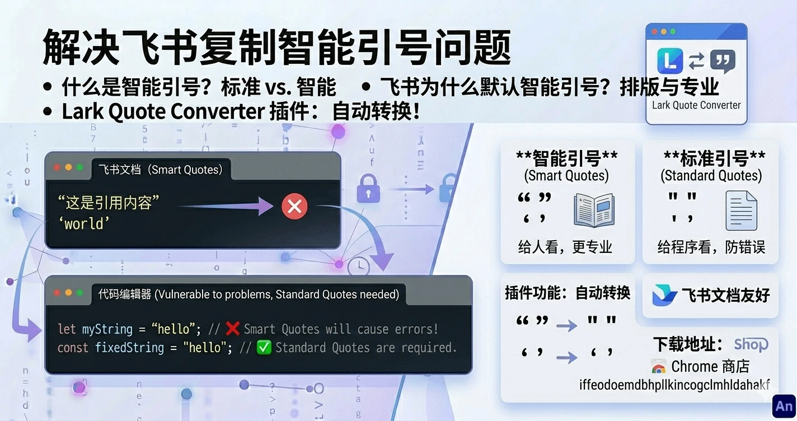

如果你从飞书文档复制过内容到文本编辑器，有可能会遇到智能引号导致的问题。

## 什么是智能引号？

我们平时敲键盘输入的引号是这样的：

```javascript
"
'
```

这叫 **标准引号（ASCII 引号）**。

而像下面这种：

```typescript
“ ”
‘ ’
```

叫 **智能引号（Smart Quotes）**，也叫弯引号。

它们的特点是：

- 左右形态不同

- 更符合排版规范

- 更适合阅读

- 常见于书籍、新闻、正式文档

简单理解：

- 标准引号 = 给程序看的

- 智能引号 = 给人看的

---

## 为什么飞书文档用智能引号？

因为飞书本质是一个文档工具，而不是代码编辑器。

在文档排版里，智能引号更美观，也更专业：

“这是引用内容”

看起来会比：

"这是引用内容"

更像正式出版物的排版。

所以飞书默认会把你输入的直引号自动替换成智能引号。

这在写文章时很好，但在写代码时就会出问题。

---

# lark-quote-converter

为了解决这个问题，我做了一个很简单的 Chrome 插件：

[lark-quote-converter](https://github.com/Hexi1997/lark-quote-converter)

它只做一件事：

把从飞书复制出来的智能引号，自动转换成标准引号。

```typescript
“hello” → "hello"
‘world’ → 'world'
```

不改别的内容，不加功能，只处理引号。

---

## 下载地址

Chrome 商店下载：

<https://chromewebstore.google.com/detail/lark-quote-converter/iffeodoemdbhpllkincogclmhldahakf>
