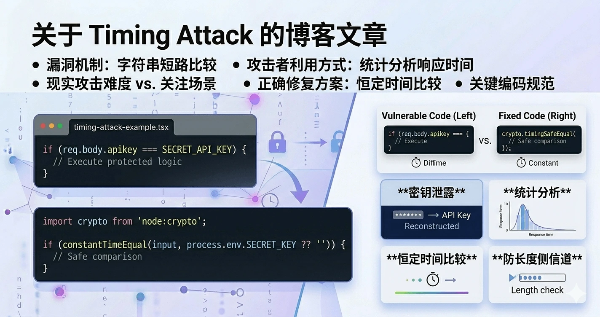

在 X（Twitter）刷到一条 [推文](https://x.com/sebastienlorber/status/1932367017065025675)，作者提出以下的代码存在 **timing attack 漏洞**

```javascript
if (req.body.apikey === SECRET_API_KEY) { ... }
```

当时觉得不可思议，就和 Grok 讨论了下。下面是完整的技术梳理。漏洞机制字符串相等比较（JavaScript 的 ===，Python 的 ==，Java 的 equals 等）通常采用短路逐字节比较：

- 从索引 0 开始逐个比较
- 一旦任意位置不匹配，立即返回 false，后续字节不再检查

这直接导致执行时间泄露信息：

- 不匹配位置越靠前 → 比较结束越早（时间更短）
- 前缀匹配越长 → 需要比较的字节越多（时间更长）

以秘密值 "qwerty" 为例：

- "awerty" → 第 1 字节不同 → 最快返回
- "qwertx" → 第 6 字节不同 → 明显更慢
- "qwerty" → 完整匹配 → 最慢（全遍历）

攻击者可通过以下步骤利用：

1. 向目标端点发送大量精心构造的探测字符串
2. 使用高精度计时器记录每次请求的响应时间
3. 统计分析：响应时间显著更长的前缀 → 很可能正确
4. 逐字节固定正确前缀 + 尝试下一个字符，逐步重建完整秘密值

目标通常是固定长度常量：API Key、HMAC、签名、reset token、会话令牌等。现实攻击难度

- 公网：极难。网络抖动（毫秒级）远超比较时间差（纳秒～微秒级），CDN、负载均衡、WAF、速率限制会进一步破坏信号。
- 仍需关注的场景：内网 RPC、低延迟服务、边缘函数、测试/本地环境、同机侧信道。

即便实际利用门槛高，该问题在安全扫描、代码审计、渗透测试报告中常被标记为中危。正确修复方案使用**恒定时间比较（constant-time equality check）**，确保无论差异出现在哪里，比较耗时都近似相同。Node.js / TypeScript 推荐实现

```typescript
import crypto from 'node:crypto';

function constantTimeEqual(a: string, b: string): boolean {
  const bufA = Buffer.from(a, 'utf8');
  const bufB = Buffer.from(b, 'utf8');

  // 长度不同直接拒绝（防长度侧信道）
  if (bufA.length !== bufB.length) {
    return false;
  }

  return crypto.timingSafeEqual(bufA, bufB);
}

// 在路由 / 中间件中使用
if (constantTimeEqual(input, process.env.SECRET_KEY ?? '')) {
  // 验证通过
} else {
  // 拒绝
}
```

关键编码规范

1. 所有用户输入 vs 服务端固定秘密的字节/字符串比较，必须使用语言提供的 timing-safe 函数。
2. 先校验长度，不相等直接返回 false。
3. 不要自行手写“伪恒定时间”循环（容易被编译器/CPU 优化掉，或引入新 bug）。
4. 前端基本无需处理（密钥不应驻留客户端），但若涉及 Web Crypto 自验签名，也需避免短路比较。
