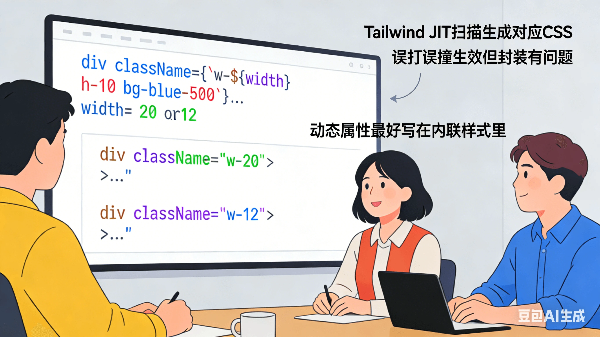

公司最近有个后端要来前端组，Review 了一下他的代码

```html
<div className={`w-${width} h-10 bg-blue-500`}>...</div>
```

width 是变量，比如 "20"、"12" 。我心想：这不应该崩吗？Tailwind 不是只认静态完整类名的吗？结果……它真的生效了。我懵了，烧烤了半天以后翻代码。翻到前面几百行，发现有人写过：

```html
<div className="w-20">...</div>
<div className="w-12">...</div>
```

哦～ 原来是因为**项目里已经静态写过 w-20 和 w-12，Tailwind JIT 扫描时把它们对应的 CSS 生成出来了**。误打误撞生效了，但是这样封装是有问题的，动态属性最好写在内联样式里。
