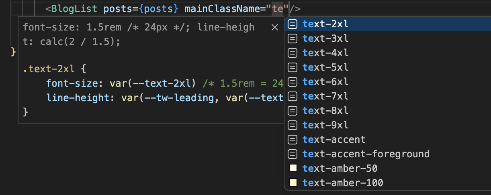

`Tailwind CSS IntelliSens`是一个`VSCode`插件，用来做语法提示和自动补全。属于必装插件。

[https://marketplace.visualstudio.com/items?itemName=bradlc.vscode-tailwindcss](https://marketplace.visualstudio.com/items?itemName=bradlc.vscode-tailwindcss)

把经常遇到问题罗列如下：

## 1、需要空格才能触发自动补全
`.vscode/settings.json`中如下配置，即可解决
```json
"editor.quickSuggestions": {
  "strings": true
},
```

## 2、自定义自动补全触发时机
插件默认只有用户在写`className=xxx`的时候会触发自动补全，如果想要别的方式触发自动补全。可以在`settings.json`中通过配置 `tailwindCSS.experimental.classRegex` 来解决问题
```json
"tailwindCSS.experimental.classRegex": [
  ["cn\\(([^)]*)\\)", "[\"'`]([^\"'`]*)[\"'`]"],
  ["\\b\\w*Style\\b\\s*=\\s*[\"'`]([^\"'`]*)[\"'`]"],
  ["\\b\\w*ClassName\\b\\s*=\\s*[\"'`]([^\"'`]*)[\"'`]"],
  ["\\b\\w*ClassNames\\b\\s*=\\s*[\"'`]([^\"'`]*)[\"'`]"]
]
```
更多的自定义规则可参考：[https://github.com/paolotiu/tailwind-intellisense-regex-list#classnames](https://github.com/paolotiu/tailwind-intellisense-regex-list#classnames)

效果如下：
