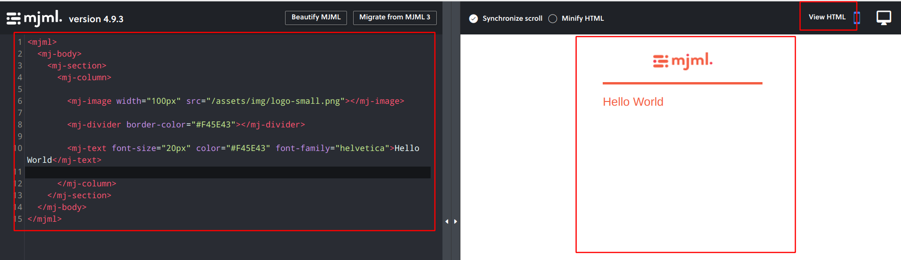
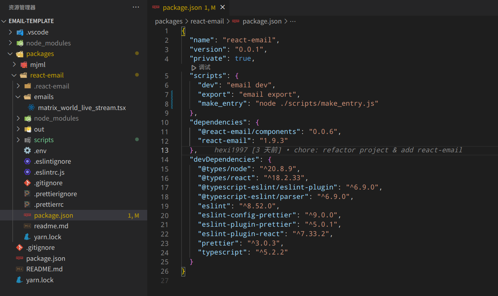
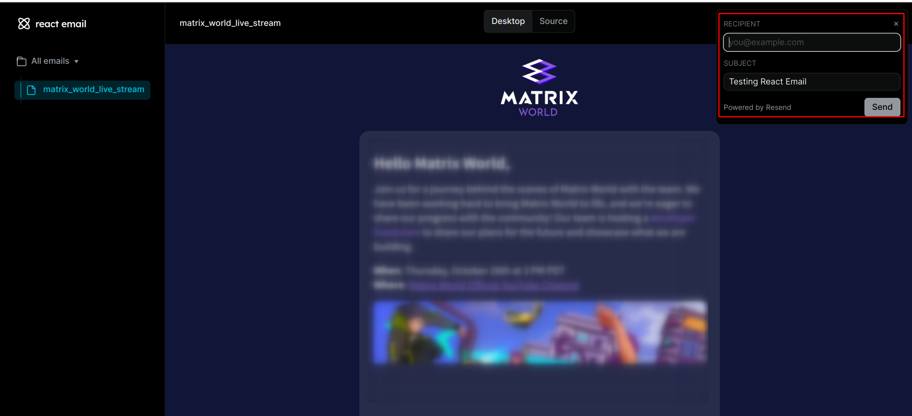

## 邮件兼容性问题
自从进入公司以后，一直在负责邮件开发的工作。

想起来写第一封邮件的时候，用 html、css复原了设计稿以后。

一发送，人傻了。。。页面由于兼容性问题变的奇奇怪怪的。

上网搜索了一些资料以后，发现是邮件客户端不支持最新的 html5、css3。甚至不支持 flex 布局，更别说 grid 布局了。

**只支持基础的 table 布局**。对于一个高度依赖 flex 布局的前端来说，不让我写 flex。那我还不如让我去死😇。

还有许许多多其他的兼容性问题，具体可以参考

https://www.infoq.cn/article/fxglbktqax4uztloxzd3
https://www.caniemail.com/

## mjml
在那个时间点（2021年），网上推荐的解决方案都是使用[mjml](https://mjml.io/)  。

摘段官网的定义： MJML is a markup language designed to reduce the pain of coding a responsive email. Its semantic syntax makes it easy and straightforward and its rich standard components library speeds up your development time and lightens your email codebase. MJML’s open-source engine generates high quality responsive HTML compliant with best practices.  简单来说，mjml就是针对邮件开发的组件库，提供了各种各样的组件以供使用。不用考虑兼容性问题，它会自动兼容各个邮件客户端。

简单学习了 mjml components 的用法以后，在官网的 [try it alive](https://mjml.io/try-it-live) 页面开始了开发工作，然后将 mjml 代码和 转译后的 html 代码复制到 git仓库实现备份 。如此即完成了一个邮件的开发工作。



## react-email
在此后的2年时间里，一直采用 mjml 的解决方案编写着各种邮件，大概有40多封。速度是越来越快，但是使用过程中仍然有一些痛点，例如 不够自由、不够工程化、不支持发送测试邮件等。

大约在一年之前，[react-email](https://react.email/) release 了 1.0 版本，当时twitter 上就有一些开发者安利，它的官方简介是： A collection of high-quality, unstyled components for creating beautiful emails using React and TypeScript. 你懂的，这对前端开发者来说，简直无法拒绝。所以我也一直在默默关注，但是我一直都没有投入使用。该怎么说，公司的邮件页面每次变化都不太大，直接 copy 已有的 mjml 代码改一改就行了。还是自己的惰性在作祟😆

上周终于正式用起来了，确实解决了很多痛点，例如

* 集成更加系统化、工程化，支持组件抽象




* 可以使用 `email export` 命令导出转译后的 html 代码。再结合 cloudflare pages流水线，方便实现线上邮件预览。

* 默认集成 [Resend](https://resend.com/) 支持在开发过程中随时发送测试邮件，预览真实效果。

  

* 支持 tailwind css，使得响应式页面开发更加简单

```html
import { Button } from '@react-email/button';
import { Tailwind } from '@react-email/tailwind';

const Email = () => {
  return (
    <Tailwind
      config={{
        theme: {
          extend: {
            colors: {
              brand: '#007291',
            },
          },
        },
      }}
    >
      <Button
        href="https://example.com"
        className="bg-brand px-3 py-2 font-medium leading-4 text-white"
      >
        Click me
      </Button>
    </Tailwind>
  );
};
```


## 一些思考

邮件开发中还有一些痛点，例如

* 如何实现多个邮件客户端的实时预览的支持（更好的开发体验）
* web font的支持差，无法还原设计效果
* 由于兼容性问题无论是 mjml 还是 react-email css 属性继承不符合直觉（点名批评163邮箱）
* 公司后端邮件发送集成的是 mailgun。仍然需要手动将邮件html代码复制粘贴。Resend 是否是更好的选择？


~~_后记：这篇博客从有想法到下笔，隔了整整一周。我太懒了，以后还是要勤快点_~~